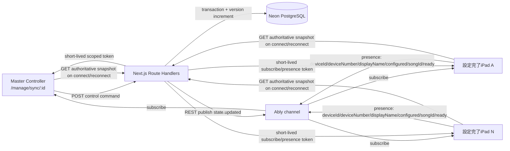
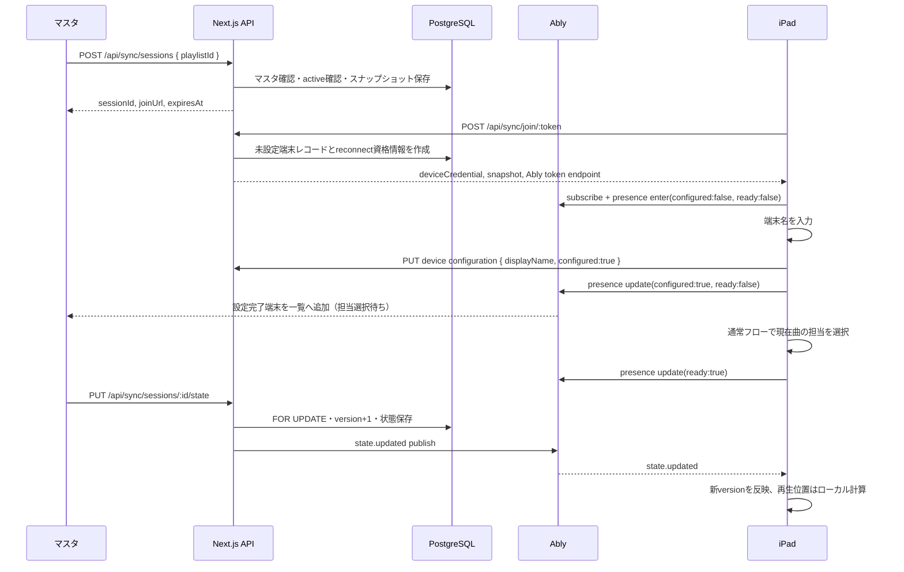
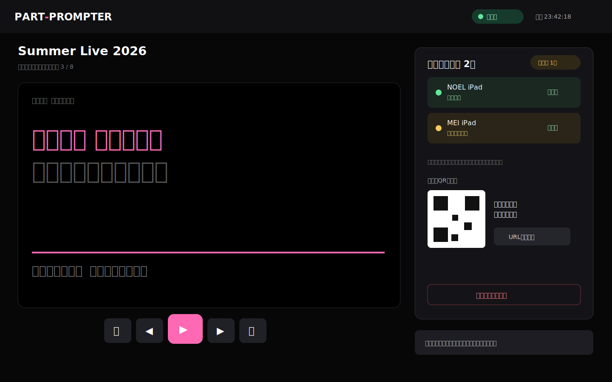

# 技術設計書: Ablyリアルタイム同期プロンプター

## Overview

本機能は、Ably Pub/Subを利用し、`users.id = 1`のマスタユーザーが操作する1台のブラウザ端末から、同一会場で端末設定を完了した可変台数のiPadへセットリスト、楽曲、ページ、再生状態を同期する。運用上は3台程度を想定するが、セッション作成時に予定台数を設定せず、設定完了端末だけをコントローラーへ動的に表示する。表示端末は期限付き参加URLまたはQRコードからログインなしで参加し、端末名の入力後、曲ごとに担当メンバーを選ぶ。担当選択は端末内にのみ保持し、歌詞の主旋律・複数担当・上ハモ・下ハモを判定して担当文字を強調する。

既存の通常プロンプターURLと操作は維持する。同期機能は`/manage/sync`と`/sync/[joinToken]`に分離し、通常プロンプターではAbly接続を開始しない。`ABLY_API_KEY`はNext.jsサーバーだけが保持し、ブラウザにはセッションと役割に限定した短期TokenRequestを返す。

## Goals / Non-goals

| 区分 | 内容 |
|---|---|
| Goal | 1コントローラーと、端末設定を完了した可変台数の表示端末を1セッションとして同期する |
| Goal | 曲・ページ・再生/停止・基準再生位置を順序保証された状態として同期する |
| Goal | 短い通信断では最後の歌詞を維持し、再接続後に最新状態へ復帰する |
| Goal | 各iPadの担当パート選択を他端末やサーバーへ送信せずローカル表示に反映する |
| Non-goal | 複数会場・複数同時セッション、LANのみのオフライン同期、音声/動画配信 |
| Non-goal | 一般ユーザーへの同期機能公開、ネイティブiOSアプリ、通常プロンプターのURL変更 |

## Design Decisions

| 判断 | 採用案 | 理由 |
|---|---|---|
| 主導線 | セットリスト編集の「同期プロンプターを開始」＋マスタ専用`/manage/sync` | 本番単位の操作をグローバル設定から分離し、進行中セッションへ復帰しやすくする |
| 状態の正本 | PostgreSQLの同期セッション行 | Vercel上で常駐WebSocketサーバーを持たず、再接続時に確実な最新状態を返す |
| 配信経路 | コントローラー→Route Handler→DB更新→Ably REST publish | `SELECT ... FOR UPDATE`でversionを一意に増加させ、更新順序と永続化を一致させる |
| 表示端末接続 | Ably Realtime subscribe＋presence | 状態イベントと接続/準備状態を別責務にする |
| セットリスト内容 | セッション作成時にJSONBスナップショットを保存 | セッション中の編集や非公開楽曲に影響されず、参加した全表示端末へ同じ内容を返す |
| 参加秘密 | 生トークンは作成時だけ返し、DBにはSHA-256ハッシュを保存 | DB漏えい時に参加URLを復元できないようにする。紛失時は再発行する |
| 最新状態復元 | `GET snapshot`を正本、Ably履歴は補助 | Message Persistence設定に依存せず復旧できる |
| 再生進行 | `positionMs + (now - startedAt)`を各端末で計算 | 毎フレーム配信を避けAbly Freeのメッセージ数を抑える |
| 権限判定 | DBでセッションメールからユーザーを引き、`id === 1`を確認 | 現行のメールアドレス直書き判定を新機能へ持ち込まない |

## Architecture



## Runtime Flow


## Routes and API Interfaces

### Pages

| Route | Auth | Responsibility |
|---|---|---|
| `/manage/sync` | ログイン＋user_id=1 | 新規作成、activeセッションへの復帰、終了済み表示 |
| `/manage/sync/[sessionId]` | ログイン＋user_id=1 | コントローラー、QR、設定完了端末の動的一覧、同期操作、終了 |
| `/sync/[joinToken]` | 参加トークン | iPad参加、担当選択、同期プロンプター、終了案内 |

セットリスト編集`/manage/playlists/[id]`には、サーバーから取得した`canUseSyncPrompter`が真の場合のみ「📡 同期プロンプターを開始」を表示し、`/manage/sync?playlistId={id}`へ遷移する。AppMenuとSideNavにも同じ権限フラグで`📡 同期プロンプター`を表示する。クライアントの表示判定はUX目的であり、認可の正本は各Route HandlerのDB照合とする。

### Route Handlers

| Method / Path | Caller | Main response / behavior |
|---|---|---|
| `GET /api/sync/capability` | 管理UI | `{ canUseSyncPrompter: boolean }`。ID自体は返さない |
| `GET /api/sync/sessions` | マスタ | activeセッションまたは作成可能状態 |
| `POST /api/sync/sessions` | マスタ | セッション作成、参加URLを作成時のみ返す。active存在時409 |
| `GET /api/sync/sessions/[id]` | マスタ | 正本snapshot、設定完了端末一覧、設定中件数、期限、状態 |
| `PUT /api/sync/sessions/[id]/state` | マスタ | 入力検証、version更新、DB保存後にAbly publish |
| `POST /api/sync/sessions/[id]/join-token` | マスタ | 参加トークンをローテーションし新URLを返す |
| `DELETE /api/sync/sessions/[id]` | マスタ | endedへ遷移し`session.ended`をpublish |
| `POST /api/sync/sessions/[id]/ably-token` | マスタ | 当該channelのsubscribe/presence TokenRequest |
| `POST /api/sync/join/[token]` | iPad | 未設定端末を登録または既存端末を復帰し、端末資格情報とsnapshotを返す |
| `PUT /api/sync/devices/[deviceId]/configuration` | iPad | 端末名と設定完了フラグを保存。担当メンバーIDは受け取らない |
| `GET /api/sync/devices/[deviceId]/snapshot` | iPad | 端末資格情報を検証して最新snapshotを返す |
| `POST /api/sync/devices/[deviceId]/ably-token` | iPad | 当該channelのsubscribe/presence TokenRequest |

状態更新APIはクライアントから任意の`version`や`startedAt`を受け入れない。操作種別`selectSong | previousPage | nextPage | play | pause | seek`と必要な値だけを受け取り、サーバーが現在行を`FOR UPDATE`して次状態、UTCの`startedAt`、`version + 1`を生成する。Ably publish失敗時はDB状態を保持してHTTP 503を返し、コントローラーは再送前にsnapshotを再取得する。重複操作を防ぐため各要求に`commandId`（UUID）を付け、直近commandIdをセッション行に保存して冪等に扱う。

## Data Models

`initDb()`内で既存方針どおり冪等DDLを追加する。日時はUTCで扱い、新規テーブルは`TIMESTAMPTZ`を使用する。

```sql
CREATE TABLE IF NOT EXISTS prompter_sync_sessions (
  id UUID PRIMARY KEY,
  playlist_id INTEGER NOT NULL REFERENCES playlists(id),
  created_by INTEGER NOT NULL REFERENCES users(id),
  status TEXT NOT NULL CHECK (status IN ('active','ended','expired')),
  join_token_hash TEXT NOT NULL,
  playlist_snapshot JSONB NOT NULL,
  current_song_index INTEGER NOT NULL DEFAULT 0,
  current_block INTEGER NOT NULL DEFAULT -1,
  is_playing BOOLEAN NOT NULL DEFAULT false,
  position_ms INTEGER NOT NULL DEFAULT 0,
  started_at TIMESTAMPTZ,
  version BIGINT NOT NULL DEFAULT 0,
  last_command_id UUID,
  created_at TIMESTAMPTZ NOT NULL DEFAULT CURRENT_TIMESTAMP,
  expires_at TIMESTAMPTZ NOT NULL,
  ended_at TIMESTAMPTZ
);
CREATE UNIQUE INDEX IF NOT EXISTS uq_sync_active_creator
  ON prompter_sync_sessions(created_by) WHERE status = 'active';
```

```sql
CREATE TABLE IF NOT EXISTS prompter_sync_devices (
  id UUID PRIMARY KEY,
  session_id UUID NOT NULL REFERENCES prompter_sync_sessions(id) ON DELETE CASCADE,
  device_number INTEGER NOT NULL,
  display_name TEXT,
  configured_at TIMESTAMPTZ,
  reconnect_token_hash TEXT NOT NULL,
  created_at TIMESTAMPTZ NOT NULL DEFAULT CURRENT_TIMESTAMP,
  last_seen_at TIMESTAMPTZ NOT NULL DEFAULT CURRENT_TIMESTAMP,
  released_at TIMESTAMPTZ,
  UNIQUE(session_id, device_number)
);
CREATE INDEX IF NOT EXISTS idx_sync_devices_session ON prompter_sync_devices(session_id);
CREATE INDEX IF NOT EXISTS idx_sync_devices_configured
  ON prompter_sync_devices(session_id, configured_at);
```

`device_number`は固定枠ではなく、同一セッション内で端末を識別する単調増加番号である。参加時にセッション行を`FOR UPDATE`し、既存最大値+1を割り当てる。`display_name`と`configured_at`が揃うまでは設定中端末として扱い、コントローラーの詳細一覧には含めない。設定途中の件数だけを別表示する。設定完了後は切断しても行を維持し、同じreconnect credentialで同じ端末へ復帰する。

期限切れ判定は各APIアクセス時に`expires_at <= CURRENT_TIMESTAMP AND status='active'`を`expired`へ更新する遅延失効方式とする。新規作成は`withTransaction()`内で期限切れ更新、active確認、スナップショット生成、INSERTを同一接続で実行する。セットリストは`created_by = 1`を確認し、順序付き楽曲、メンバー、歌詞、表示設定を`playlist_snapshot`へ保存する。セッション作成後の編集はactiveセッションへ反映せず、再作成時に反映する。

## Domain Types and Events

```typescript
export interface SyncState {
  sessionId: string
  songIndex: number
  songId: number
  currentBlock: number
  isPlaying: boolean
  positionMs: number
  startedAt: string | null
  version: number
}
export type SyncEvent =
  | { name: 'state.updated'; data: SyncState }
  | { name: 'session.ended'; data: { sessionId: string; endedAt: string } }
export interface PresenceData {
  deviceId: string
  deviceNumber: number
  displayName: string
  configured: boolean
  songId: number
  ready: boolean
}
```

チャンネル名は`part-prompter:session:{sessionId}`とする。stateイベントはDBコミット後にサーバーから1回publishする。表示端末は保持中のversionより大きい場合だけ適用する。再生中の現在位置は`positionMs + max(0, Date.now() - Date.parse(startedAt))`、停止中は`positionMs`とする。曲変更時は`currentBlock=-1`、`isPlaying=false`、`positionMs=0`、`startedAt=null`へリセットする。

コントローラーはPresenceの`enter / update / leave`を受信順に直列処理する。端末名設定直前の未設定snapshotが設定完了後に遅れて返っても一覧を巻き戻さないよう、master snapshotは`Cache-Control: no-store`かつクライアントfetchも`cache: 'no-store'`とし、並行取得にはrequest generationを適用する。設定完了端末はセッション中に未設定へ戻らない単調状態としてマージし、子端末側も古いdevice snapshotの`configured:false`で確定済み状態を上書きしない。
## Components and Interfaces

| Module | Responsibility |
|---|---|
| `src/lib/sync/master.ts` | `auth()`のemailからユーザーを取得し`id === 1`を判定するサーバー専用ヘルパー |
| `src/lib/sync/session.ts` | セッション作成・失効・終了・可変端末登録/設定完了・snapshot取得。DB I/Oを集約 |
| `src/lib/sync/state.ts` | コマンドから次の`SyncState`を計算する純粋ロジック |
| `src/lib/sync/highlight.ts` | 主旋律・複数担当・上下ハモと選択IDの交差判定を行う純粋ロジック |
| `src/lib/sync/tokens.ts` | join/reconnect token生成・SHA-256化、Ably TokenRequest生成 |
| `src/lib/sync/ably.ts` | サーバー専用Ably RESTクライアントとpublish。`ABLY_API_KEY`をここ以外で参照しない |
| `src/components/prompter/PrompterStage.tsx` | 既存の歌詞描画・表紙・現在/次ブロックを再利用可能に分離 |
| `src/components/sync/SyncController.tsx` | 進行操作、設定完了端末の動的一覧、設定中件数、QR、接続/準備状態、終了確認 |
| `src/components/sync/MemberSelector.tsx` | 初回の端末名入力、曲ごとの複数担当選択、端末設定完了/準備完了 |
| `src/components/sync/SyncViewer.tsx` | snapshot取得、Ably購読、version適用、再接続表示、ローカル強調 |

既存`src/app/songs/[songId]/prompter/page.tsx`は表示、データ取得、再生ループ、操作が1ファイルに集中している。実装ではまず見た目と通常挙動を変えずに、歌詞描画とタイムライン計算を共有コンポーネント/フックへ抽出する。通常ページは従来どおりローカル操作を渡し、同期Viewerは受信した`SyncState`を渡す。同期機能を条件分岐で既存ページへ埋め込まず、回帰範囲を限定する。

### Part Highlight Algorithm

文字ごとに`mainIds`、`harmonyUpIds`、`harmonyDownIds`の和集合を`effectiveIds`とする。`effectiveIds`と端末の`selectedMemberIds`が交差する場合は担当文字として既存色・ハモリ帯・不透明度1を維持する。交差しない割当済み文字は不透明度0.2とする。割当のない文字は文脈を失わないよう白の不透明度0.55とする。複数担当は1人でも選択されていれば担当扱いとする。空白のレイアウト幅は維持する。端末名設定後の初回または曲変更後の担当が未確定でも再生が始まった場合は、担当選択画面を一時的に退避し、既存の文字色・複数担当グラデーション・上下ハモリ帯を維持したまま全歌詞を不透明度1で表示する。この間もPresenceは`ready:false`を維持し、停止後は担当選択画面へ戻る。端末名が未設定の場合は再生状態にかかわらず端末設定画面を維持する。

初回参加では端末名だけを入力し、`configuration` APIへ`displayName`と`configured:true`だけを送って端末設定を完了する。その直後、曲変更時と同じ担当選択モーダルをプロンプター上に表示し、現在曲の担当を1名以上選択する。担当選択は`sessionStorage`の`part-prompter:sync:{sessionId}:parts:{songId}`へ保存し、曲変更ごとに必ずモーダルを表示して前回値は初期選択としてだけ利用する。presenceへ送るのは`deviceId`、`deviceNumber`、`displayName`、`configured`、`ready`、`songId`で、メンバーIDは送らない。端末名設定後から担当確定までは`configured:true, ready:false`とし、コントローラーには「担当選択待ち」で表示する。曲別担当選択と「担当変更」はどちらもプロンプター上のモーダルとして表示し、再選択中は一覧に残したまま`ready:false`へ更新する。キャンセルは手動の担当変更時だけ許可し、モーダル開始前の担当、選択理由、`ready`状態を復元して未確定端末を誤って準備完了にしない。

各表示端末は歌詞領域の左半分タップまたは前ボタンで1ページ前、右半分タップまたは次ボタンで1ページ後を端末ローカルに表示できる。端末種別・画面向きに依存せず同じ操作を提供する。この手動表示は同期stateを変更せず、同期計算上の表示ページが手動表示ページへ追いついた時点で自動解除して同期表示へ戻る。新しい有効な`state.updated`、再接続snapshot、または表示ブロック再構成時にも解除する。設定パネル、操作ボタン、担当選択モーダルの操作は背景タップとして扱わない。Viewer上部の選択担当バッジは、選択したメンバー名をそれぞれ登録済みのパート色で表示する。子端末の操作ボタン列には全画面アイコンを表示し、Fullscreen API対応ブラウザでは全画面表示の開始と終了を切り替える。標準APIに加えてWebKit接頭辞付きAPIも検出し、非対応環境ではボタンを表示しない。

## Authentication and Ably Capabilities

- コントローラーAPIは毎回`requireSyncMaster()`で`users.id = 1`を確認する。
- 表示端末APIはjoin tokenまたはreconnect credentialのSHA-256ハッシュを比較し、activeかつ期限内のセッションだけ許可する。
- ブラウザはAPIキーを受け取らない。`ABLY_API_KEY`は`src/lib/sync/ably.ts`のサーバーコードだけで読む。
- TokenRequestのcapabilityは正確な1チャンネルへ限定する。コントローラーと表示端末は`subscribe`と`presence`のみ。状態publishはサーバーAPIだけが行う。
- TokenRequest TTLは最大60分とし、Ably SDKのauthCallbackで期限前に再取得する。セッション期限を超えるTTLは発行しない。
- join tokenとreconnect tokenは`crypto.randomBytes(32)`、session/device IDは`crypto.randomUUID()`で生成する。
- `.env.local.example`には値なしの`ABLY_API_KEY=`を追記し、`NEXT_PUBLIC_`接頭辞を禁止する。

## UI Flow and Mockups

### 1. セットリストからセッション作成（Desktop 1440×900）


マスタだけに開始ボタンを表示する。予定台数は設定せず、24時間有効・セットリスト内容固定を明示する。空セットリストでは作成操作を無効化する。

### 2. 作成後から端末設定完了までの一連フロー（Desktop 1440×900 / iPad Landscape 1194×834）


セッション作成後、コントローラーに同一の参加URLとQRコードを表示する。必要な表示端末が順次QRコードを読み取り、初回は1〜20文字の端末名だけを入力して「端末設定を完了」を実行する。この時点で設定完了端末一覧へ追加し、状態を「担当選択待ち」とする。その後、プロンプター上の曲別担当選択モーダルで現在曲の担当を1名以上選び「担当を確定」する。端末名入力中だけはコントローラーに「設定中 N台」として件数を表示し、詳細カードは出さない。

### 3. マスタコントローラー（Desktop 1440×900）



現在曲のプレビューと操作を左、設定完了端末の動的一覧、設定中件数、QR、URLコピー、終了を右側の単一情報パネルに配置する。情報パネル全体はヘッダー操作でまとめて表示・非表示を切り替えられ、非表示時はコントローラーを1カラムへ変更してプレビューの幅と高さを拡大する。設定完了端末数は再表示ボタンにも示す。曲移動は前後曲ボタンまたは曲タイトルのセレクト欄で行う。セレクト欄には曲タイトルを表示するが、重複する「曲」というラベル文字は表示しない。設定完了端末は曲変更後も一覧に残し、状態を`準備完了 / 担当選択待ち / 切断中`で示す。activeセッションへ再訪した場合はこの画面へ直接復帰する。参加URLを失った場合は再発行し、旧URLを即時無効化する。

### 4. 表示端末の担当選択（iPad Landscape 1194×834）


初回の端末設定画面では端末名だけを入力する。保存後はプロンプターを表示し、その上に曲変更時と共通の担当選択モーダルを重ねる。現在曲の担当を1名以上選択するまで`ready:false`を維持する。選択IDは端末ローカルに保持し、API、Ably、Presenceへ送信しないが、この説明文はモーダル内には表示しない。曲変更後も同じ設定完了端末のまま担当を再選択し、コントローラーには準備済みかだけを通知する。

### 5. 同期歌詞表示（iPad Landscape 1194×834）


担当文字を既存色のまま強調し、非担当文字を減光する。通信断では歌詞を消さず「再接続中」を重ねる。再接続後はsnapshotのversionを比較して最新状態へ移る。終了イベント受信後は操作不能の終了案内へ切り替える。

## Error Handling

| Case | Behavior |
|---|---|
| `ABLY_API_KEY`未設定 | 作成/token/state APIは503。画面に「同期サービスを利用できません」を表示し秘密情報は出さない |
| activeセッション存在 | 409とactive IDを返し、UIは「進行中セッションへ戻る」を表示 |
| 端末名が1〜20文字の範囲外 | configuration APIは400。端末設定画面に日本語の検証メッセージを表示し、未設定状態を維持 |
| 現在曲の担当が未選択 | 担当確定操作を無効化し、Presenceの`ready:false`を維持する |
| 不正token | 404、期限切れ/終了済みは410。セッション情報を漏らさない |
| DB更新失敗 | publishしない。コントローラー操作を元に戻して再試行案内 |
| DB成功・publish失敗 | 503。snapshotは更新済みのため、再接続/再取得で収束する。次操作前にsnapshotを再取得 |
| Ably切断 | 最後の表示を維持。コントローラーは操作を無効化、Viewerは再接続中バナー。復帰時GET snapshot |
| セッション終了 | `session.ended`をpublishし、以後token発行・制御・参加を拒否 |

## Accessibility and Responsive Design

操作ボタンは44×44 CSS px以上、状態は色だけでなく日本語ラベルとアイコンで示す。モーダルは`role="dialog"`、`aria-modal`、フォーカストラップ、Escape、終了後のフォーカス復帰を実装する。コントローラーは1024px以上を主対象とし、狭い幅では端末一覧を下段へ移す。ViewerはiPad横向きを主対象とするが、縦向きでは既存スクロール表示を維持し担当選択を画面内に収める。`prefers-reduced-motion`時は不要な遷移アニメーションを無効化する。

## Testing Strategy

新規テストファイルの追加は実装着手時にユーザーの明示依頼がある場合に限る。実装後は少なくとも対象ESLint、`npm run build`、既存`npm run test`を単発実行する。手動スモークテストはPC 1タブをコントローラー、複数のiPad相当タブをViewerとして、同一QR/URLからの順次参加、端末名1〜20文字の検証、設定中件数だけの表示、設定完了後の動的カード追加、ページ/曲/再生同期、曲変更後の担当選択待ち、担当減光、30秒以内再接続、切断中表示、終了、通常プロンプター非接続を確認する。担当member IDがconfiguration API、Ablyイベント、Presence、サーバーsnapshotへ含まれないこと、同じreconnect credentialで端末登録が重複しないことも検証する。実Ably確認ではAPIキー・token・join URLがログや画面キャプチャへ露出しないことを確認する。

## Implementation Notes

実装前に`node_modules/next/dist/docs/`の当該Next.js 15 Route Handler、動的params、Server/Client Componentガイドを確認し、既存の`{ params: Promise<...> }`形式に従う。AblyとQR生成ライブラリは導入時点の公式ドキュメントを再確認し、package.jsonへ正確な固定バージョンで追加する。QRコードは参加URLの表示用途だけとし、生成失敗時もURLコピーで参加可能にする。

Vercelの環境変数は、名前を`ABLY_API_KEY`、値をAblyダッシュボードから取得したAPIキー本体として別々に登録する。値へ`ABLY_API_KEY=`という代入式、引用符、前後空白を含めない。サーバーはキー名部分とsecretを区切る`:`およびキー名内の`.`を検証し、形式不正時は秘密値をログやレスポンスへ出さず設定エラーを返す。

## Correctness Properties

### Property 1: マスタ権限の排他性
任意の認証済みユーザーについて、同期セッション作成・制御・終了・controller資格情報発行が成功するのは、DB照合結果の`users.id`が厳密に1の場合に限る。UIの表示有無やemail文字列はこの判定結果を変更しない。
**Validates: Requirements 1.1, 1.2, 1.3, 1.4, 1.5**

### Property 2: 更新versionの単調増加
任意のactiveセッションと受理された状態変更コマンド列について、コミット済み`version`はコマンドごとに厳密に1増加し、同じ`commandId`の再送では増加しない。Viewerが適用するversionは単調非減少となる。
**Validates: Requirements 5.6, 5.7, 6.5**

### Property 3: 端末識別と設定完了一覧の整合性
任意の並行参加要求について、`device_number`は同一セッション内で一意かつ単調増加し、端末数に固定上限を設けない。同じreconnect credentialによる再接続は新しい端末レコードを作成せず、元の`device_number`、`display_name`、`configured_at`を維持する。`configured_at`がない端末は設定中件数にだけ含まれ、設定完了一覧には含まれない。設定完了後は曲変更や切断でも一覧から削除されず、状態だけが`担当選択待ち`または`切断中`へ変化する。
**Validates: Requirements 3.5, 3.6, 3.9, 3.10, 8.1, 8.2, 8.3, 8.4, 8.5, 8.6, 8.7, 8.8**

### Property 4: 再生位置計算の整合性
任意の有効な`positionMs`、`startedAt`、現在時刻について、再生中の計算位置は`positionMs`以上で経過時間と同じ量だけ増加し、停止中は時刻にかかわらず`positionMs`と一致する。状態不変中にAbly publishは発生しない。
**Validates: Requirements 6.1, 6.2, 6.3, 6.4**

### Property 5: 担当選択の秘匿と強調判定
任意の歌詞文字と選択メンバー集合について、主旋律・複数担当・上ハモ・下ハモの和集合と選択集合が交差する場合に限り担当文字となる。選択メンバーIDはpresence、同期イベント、サーバーsnapshotへ含まれない。
**Validates: Requirements 7.3, 7.4, 7.5, 7.6, 7.7**

### Property 6: 終了状態の不可逆性
任意のセッションについて、`ended`または`expired`へ遷移した後に`active`へ戻る操作は存在せず、参加・資格情報発行・状態変更はすべて拒否される。ただし新しい別セッションの作成は許可される。
**Validates: Requirements 2.5, 2.6, 10.2, 10.3, 10.4, 10.5**
