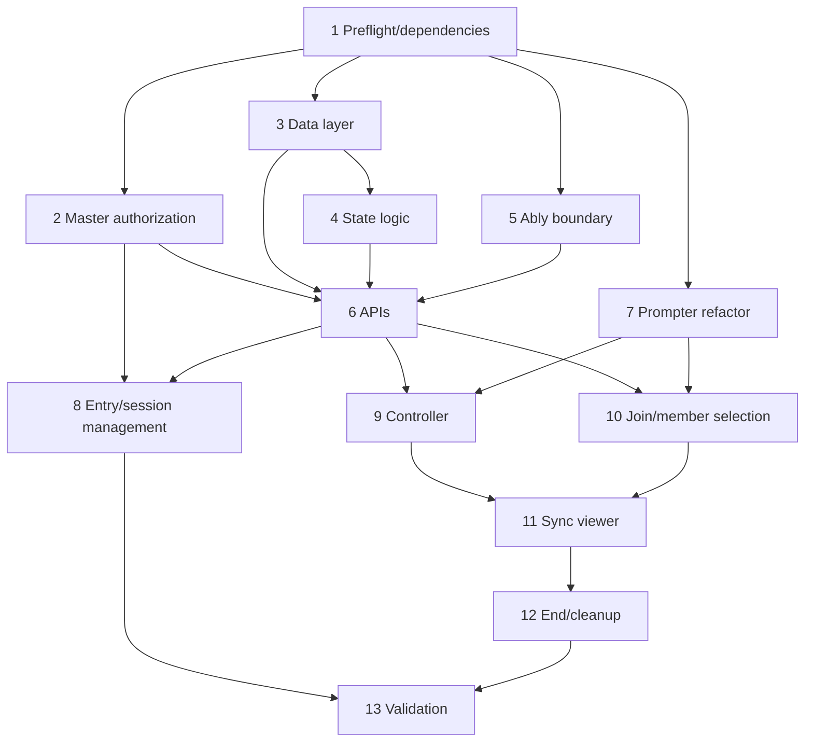

# Implementation Plan: Ablyリアルタイム同期プロンプター

## Overview

`users.id = 1`専用の同期セッションを、DB正本・Next.js Route Handler・Ably Pub/Sub・既存プロンプター描画の再利用で実装する。通常プロンプターの回帰を避けるため、認可/状態/トークンのサーバー基盤、既存表示の責務分離、管理UI、コントローラー、Viewerの順に結線する。表示端末の予定台数は設定せず、必要な台数だけ同じQR/URLから順次参加する。端末名と現在曲の担当選択を完了した端末だけを動的一覧へ表示し、1 activeセッション、24時間有効とする。

## Current Status

- 実装タスク1〜12はコード上完了。静的検証（型、Lint、build、diagnostics、diff check）も完了。
- 既存テストは48件中47件成功。残る1件は同期機能と無関係なオンボーディング総数（実装4、テスト固定値5）の既存不整合。
- タスク13.2（複数実機の手動スモークテスト）と13.3（Vercel / Ably運用確認）は未実施。

## Tasks

- [ ] 1. 実装前確認と依存関係の準備
  - `node_modules/next/dist/docs/`でNext.js 15のRoute Handler、動的`params`、Server/Client Componentの該当ガイドを確認する
  - Ably JavaScript SDKのTokenRequest・Realtime・Presence・REST publishの現行公式APIを確認する
  - `ably`とQR生成ライブラリを、確認時点の正確な固定バージョンで追加し`package-lock.json`を更新する（open rangeを使用しない）
  - `.env.local.example`へ値なしの`ABLY_API_KEY=`と用途コメントを追加し、`NEXT_PUBLIC_`を使わないことを明記する
  - _Requirements: 4.1, 4.2, 4.6, 12.1_

- [ ] 2. マスタ権限をDB上のuser_idへ統一する
- [ ] 2.1 サーバー専用認可ヘルパーを追加する
  - `src/lib/sync/master.ts`に、`auth()`のemailをパラメータ化SQLで`users`へ照合し、`id === 1`だけを許可する`getSyncMaster` / `requireSyncMaster`を実装する
  - 未認証401、認証済み非マスタ403をRoute Handlerで一貫して返せる型を定義する
  - _Requirements: 1.3, 1.5_
- [ ] 2.2 UI用の権限情報を提供する
  - `GET /api/sync/capability`を追加し、`{ canUseSyncPrompter }`だけを返してユーザーIDを公開しない
  - `AppMenu`、`SideNav`、セットリスト編集画面が同じフラグで導線を表示できるようにする
  - 既存マスタ設定のメール判定は本タスクの範囲外とし、同期機能だけをuser_id=1へ限定する
  - _Requirements: 1.1, 1.2, 1.4_

- [ ] 3. 同期セッションのデータ層を追加する
- [ ] 3.1 冪等スキーマを追加する
  - `src/lib/db.ts`の`runInitDb`に`prompter_sync_sessions`、`prompter_sync_devices`、制約、インデックスを`IF NOT EXISTS`で追加する
  - 新規日時は`TIMESTAMPTZ`、状態は`active/ended/expired`、1マスタ1 activeをDB制約で保証する
  - `prompter_sync_devices`はセッション内で一意な単調増加`device_number`、1〜20文字の`display_name`、`configured_at`、再接続資格情報を保持し、固定台数の制約を設けない
  - `query` / `withTransaction`以外のPoolを作らない
  - _Requirements: 2.1, 2.2, 2.4–2.6, 3.5, 3.6, 3.9, 8.1–8.3_
- [ ] 3.2 セッション/端末サービスを実装する
  - `src/lib/sync/session.ts`に期限切れ更新、active取得、作成、終了、参加トークン再発行、端末登録/復帰、configuration保存、snapshot取得を実装する
  - 作成時にセットリスト所有者がuser_id=1で曲が1件以上あることを検証し、順序付き楽曲・メンバー・歌詞・表示設定をJSONBへ固定する。予定端末数は受け取らない
  - `crypto.randomUUID()`と`crypto.randomBytes(32)`を使い、join/reconnect tokenはSHA-256ハッシュだけを保存する
  - 参加時はセッション行をロックし、既存最大値+1の`device_number`を採番する。同じreconnect credentialは既存端末へ戻し、重複登録しない
  - 未設定端末は設定中件数にだけ含め、`display_name`と`configured_at`が揃った端末だけを動的一覧へ返す。設定完了端末は曲変更や切断後も保持する
  - _Requirements: 2.1–2.7, 3.2–3.6, 3.9, 3.10, 8.1–8.8, 10.4, 10.5_

- [ ] 4. 同期状態の純粋ロジックと永続更新を実装する
  - `src/lib/sync/state.ts`に`SyncState`、`SyncCommand`、イベント型とコマンド別の次状態計算を実装する
  - 曲変更で表紙・停止・位置0へ戻し、ページ境界をsnapshotの表示ブロック数で検証する
  - 再生/停止/seekの`positionMs`とUTC `startedAt`をサーバー時刻から生成し、クライアント入力のversion/startedAtを信用しない
  - `SELECT ... FOR UPDATE`でversionを1増加し、`commandId`による重複要求を冪等化する
  - _Requirements: 5.1–5.7, 6.1–6.5_
- [ ] 5. Ablyサーバー境界と短期資格情報を実装する
- [ ] 5.1 トークン/ハッシュ処理を追加する
  - `src/lib/sync/tokens.ts`にjoin/reconnect token生成、SHA-256化、セッション期限を超えないTTL計算を実装する
  - controller/deviceの検証済み役割から、正確な`part-prompter:session:{sessionId}`だけに`subscribe/presence`を許可するTokenRequestを作る
  - 生の`ABLY_API_KEY`、join token、reconnect tokenをログへ出さない
  - _Requirements: 3.3, 3.4, 4.1–4.6_
- [ ] 5.2 Ably publishアダプターを追加する
  - `src/lib/sync/ably.ts`へサーバー専用RESTクライアントを遅延初期化し、`state.updated`と`session.ended`のpublishを集約する
  - APIキー未設定を秘密情報なしの503へ変換し、ブラウザバンドルから到達不能にする
  - publish結果をRoute Handlerへ返し、DB成功/publish失敗を復旧可能なエラーとして扱う
  - _Requirements: 4.1, 4.2, 4.6, 5.1–5.8, 10.2_

- [ ] 6. セッションRoute Handlersを実装する
- [ ] 6.1 マスタ用セッションAPIを追加する
  - `src/app/api/sync/sessions/route.ts`へGET/POST、`[id]/route.ts`へGET/DELETEを追加する
  - `[id]/state/route.ts`へ状態更新、`[id]/join-token/route.ts`へ参加URL再発行、`[id]/ably-token/route.ts`へcontroller TokenRequestを追加する
  - 動的paramsは`Promise<{ id: string }>`としてawaitし、全DBルート冒頭で`initDb()`を呼ぶ
  - 入力を検証し、400/401/403/404/409/410/503と日本語メッセージを統一する
  - _Requirements: 1.2, 1.3, 2.1–2.7, 4.3–4.6, 5.1–5.8, 10.1–10.5_
- [ ] 6.2 表示端末用参加・設定APIを追加する
  - `src/app/api/sync/join/[token]/route.ts`で参加/復帰、`devices/[deviceId]/configuration`で端末設定、`devices/[deviceId]/snapshot`で正本状態、`devices/[deviceId]/ably-token`でViewer TokenRequestを返す
  - reconnect credentialはブラウザ保存用に作成時だけ返し、その後はハッシュ照合する。同じ資格情報の再接続では端末登録と`device_number`を増やさない
  - configuration APIは`displayName`が1〜20文字で、現在曲の担当が端末ローカルで1名以上選択済みの場合に呼ぶ。受け取るのは`displayName`と`configured:true`だけで、member IDを受け取らない
  - snapshotには固定セットリストと現在状態を含めるが、担当member ID、join token hash、reconnect token hash、created_by、Ably API keyを含めない
  - _Requirements: 3.2–3.10, 4.2–4.5, 6.5, 7.3, 7.7, 9.3–9.5_

- [ ] 7. 既存プロンプター表示を再利用可能に分離する
- [ ] 7.1 表示コンポーネントを抽出する
  - `src/app/songs/[songId]/prompter/page.tsx`から、表紙、現在ブロック、次ブロック、縦表示、歌詞色/ハモリ帯を`src/components/prompter/PrompterStage.tsx`へ抽出する
  - 既存CSS Modulesを共有可能な単位へ移し、通常プロンプターの見た目、タップ、キーボード、設定、プレイリスト移動を変えない
  - _Requirements: 11.1–11.4_
- [ ] 7.2 タイムライン計算を抽出する
  - `startedAt`と`positionMs`から現在位置とブロックを計算する処理を再利用可能なhookまたは純粋関数へ分離する
  - 通常プロンプターは従来のローカル状態、同期Viewerは`SyncState`を入力して同じ表示ブロック計算を利用する
  - 毎フレームAblyへ送信するコードを作らない
  - _Requirements: 5.8, 6.1–6.5, 11.1–11.4_

- [ ] 8. マスタ用の開始導線とセッション管理画面を実装する
- [ ] 8.1 ナビゲーションとセットリスト導線を追加する
  - `AppMenu`と`SideNav`にマスタだけの「📡 同期プロンプター」を追加する
  - `/manage/playlists/[id]`の「▶ 表示 ↗」隣へマスタだけの開始ボタンを追加し、`playlistId`を`/manage/sync`へ渡す
  - 一般ユーザーではボタンを描画せず、直接URL/APIアクセスもサーバーで拒否する
  - _Requirements: 1.1–1.5_
- [ ] 8.2 `/manage/sync`の作成/復帰画面を実装する
  - query指定または選択したセットリスト、予定台数を設定しないこと、24時間、スナップショット固定を確認して作成する
  - activeがある場合は新規作成せず「進行中セッションへ戻る」を表示する
  - 空セットリスト、Ably未設定、作成競合を日本語で案内する
  - `mockups/session-start.svg`に合わせ、作成後は`mockups/post-creation-flow.svg`のQR→端末名→担当選択→設定完了→一覧追加へ遷移するCSS Moduleを作成する
  - _Requirements: 1.2, 2.1–2.7, 3.1–3.6, 12.1–12.3, 12.7–12.9_

- [ ] 9. マスタコントローラーを実装する
  - `/manage/sync/[sessionId]`でsnapshotとAbly TokenRequestを取得し、現在曲プレビュー、前後曲、前後ページ、再生/停止、seekを状態APIへ送る
  - Ably Presenceの`deviceId`、`deviceNumber`、`displayName`、`configured`、`songId`、`ready`だけを使い、設定完了端末を件数に応じて動的表示する。担当member IDは受信・保持しない
  - 未完了端末は詳細カードを出さず「設定中 N台」の件数だけを表示する。設定完了端末は曲変更後も残して「担当選択待ち」、切断時は「切断中」、確定後は「準備完了」と表示する
  - 作成直後は参加URLとQR、再訪時にURLがない場合は再発行操作を表示し、「必要な端末で読み取ります」と案内する
  - Ably切断中は状態変更ボタンを無効にし、復帰時にsnapshotを再取得してversionを比較する
  - `mockups/controller.svg`に合わせ、状態を色だけでなく日本語ラベルでも表示する
  - _Requirements: 3.1, 3.5, 3.6, 3.10, 5.1–5.8, 7.7, 8.1–8.8, 9.6, 10.1, 12.1–12.3, 12.6–12.9_
- [ ] 10. 表示端末の参加と担当選択を実装する
- [ ] 10.1 公開参加ページと端末復帰を実装する
  - `/sync/[joinToken]`で参加APIを呼び、端末資格情報をセッション単位で保存する。必要な台数が同じQR/URLから順次参加でき、同じ端末の更新/短時間切断では既存の`device_number`へ戻す
  - 初回は1〜20文字の端末名入力を必須とし、入力中はコントローラーに設定中件数だけを通知して詳細を公開しない
  - 不正404、期限切れ/終了410をセッション情報を漏らさない日本語画面で表示する
  - 成功後に固定セットリストsnapshotを`sessionStorage`へ保持し、端末資格情報以外を永続保存しない
  - _Requirements: 3.2–3.10, 8.1–8.3, 9.3–9.5, 10.4_
- [ ] 10.2 担当メンバー選択と端末設定完了を実装する
  - `MemberSelector`で設定端末名と初回ステップを表示し、現在曲のメンバーを1名以上複数選択する。端末名が無効または未選択では「端末設定を完了」を無効にする
  - 初回確定時にconfiguration APIへ`displayName`と`configured:true`だけを送り、完了後に設定完了端末一覧へ追加する。選択member IDは送らない
  - 選択IDを`sessionStorage`へ曲ID別に保存し、曲変更ごとに選択画面を表示して前回値を初期選択だけに使う
  - Ably Presenceへ送信するのは`deviceId`、`deviceNumber`、`displayName`、`configured`、`songId`、`ready`だけとし、選択したmember IDは送信しない
  - 曲変更または担当変更時は一覧に残したまま`ready:false`、確定時は`ready:true`へPresence updateする
  - `mockups/member-selection.svg`に合わせたiPad横向きUIを実装する
  - _Requirements: 3.3–3.5, 3.10, 7.1–7.3, 7.6, 7.7, 8.1–8.5, 12.1, 12.4, 12.6–12.9_
- [ ] 10.3 担当文字判定を実装する
  - `src/lib/sync/highlight.ts`でmain、複数担当、harmony_up、harmony_downのIDを正規化し、選択集合との交差を判定する
  - 担当文字は既存色/帯・opacity 1、非担当割当文字は0.2、未割当文字は白0.55として現在/次ブロックと縦表示へ同じ判定を適用する
  - 空白、旧`member_id`形式、メンバー削除済みIDでも表示を壊さない
  - _Requirements: 7.4, 7.5_

- [ ] 11. 同期Viewerと再接続を実装する
  - `SyncViewer`でAbly authCallback、channel購読、許可された6フィールドだけのPresence enter/update、接続状態監視を実装する
  - `state.updated`は保持versionより大きい場合だけ適用し、`startedAt`と`positionMs`からローカルで再生位置を計算する
  - 曲変更では再生ループを止め、設定完了端末として一覧に残ったまま`ready:false`で担当選択へ戻し、確定後に受信済み最新状態の歌詞を表示する
  - 切断中は最後の画面を維持して「再接続中」を表示し、コントローラーでは同じ端末を「切断中」にする。復帰時にsnapshotを取得して新しいversionへ収束し、端末を重複登録しない
  - `session.ended`または410受信時は購読を解除し「同期セッションは終了しました」画面へ移る
  - `mockups/viewer-prompter.svg`に合わせ、同期中、担当、端末名、再接続中、担当変更を表示する
  - _Requirements: 3.9, 5.7, 5.8, 6.1–6.5, 7.4–7.7, 8.4–8.7, 9.1–9.5, 10.2–10.4, 12.1, 12.5–12.7_

- [ ] 12. セッション終了とクリーンアップを完成させる
  - コントローラーの終了操作に確認ダイアログを付け、DELETE成功後に`session.ended`を受信した全端末を終了画面へ移す
  - 終了/期限切れ後は参加、token、snapshot、state更新を拒否し、次セッションを作成可能にする
  - ページ離脱時にAbly購読とイベントリスナーを解除し、通常プロンプターでAbly接続が発生しないことを確認する
  - _Requirements: 9.5, 10.1–10.5, 11.3, 11.4_

- [ ] 13. 検証と運用確認
- [ ] 13.1 静的検証を実行する
  - 変更対象へ`get_diagnostics`を実行し、`npm run lint`、既存`npm run test`、`npm run build`を単発実行する
  - buildではlintされない設定のため、lint結果を別途解消する
  - 新規テストファイルはユーザーから明示依頼がない限り追加しない
  - _Requirements: 全要件_
- [ ] 13.2 可変台数の手動スモークテストを行う
  - ユーザーが起動したHTTPS dev serverで、PCコントローラー1タブ＋複数のiPad相当タブを同じQR/URLから順次接続する
  - 予定台数入力がないこと、端末名1〜20文字、設定中件数のみの表示、担当1名以上の選択、設定完了後のカード追加、前後ページ、前後曲、再生/停止、担当強調を確認する
  - 曲変更後も端末カードが残って「担当選択待ち」になり、再選択後に「準備完了」へ戻ることを確認する
  - 1台を30秒以内切断/復帰し、最後の表示維持、再接続表示、latest version復元、同じ`device_number`の維持、重複登録なしを確認する
  - 担当member IDがAPI、Ably、Presenceへ送信されないこと、終了後の参加/制御拒否、通常プロンプターの従来操作、ブラウザ/サーバーログに秘密情報がないことを確認する
  - _Requirements: 2–12_
- [ ] 13.3 Vercel/Ably運用設定を確認する
  - Vercel Production/Previewへ`ABLY_API_KEY`をSecretとして設定し、クライアント環境変数に存在しないことを確認する
  - Ably Freeダッシュボードで実際の可変接続数、メッセージ数、エラーを確認し、毎フレームpublishがないことを確認する
  - Presence payloadが`deviceId`、`deviceNumber`、`displayName`、`configured`、`songId`、`ready`だけであることを確認する
  - join URLをログ・分析イベントへ送信せず、必要時に参加トークンを再発行できることを確認する
  - _Requirements: 4.1–4.6, 6.3, 6.4, 7.7_

## Task Dependency Graph

```json
{
  "waves": [
    { "wave": 1, "tasks": ["1"] },
    { "wave": 2, "tasks": ["2", "3", "5", "7"] },
    { "wave": 3, "tasks": ["4"] },
    { "wave": 4, "tasks": ["6"] },
    { "wave": 5, "tasks": ["8", "9", "10"] },
    { "wave": 6, "tasks": ["11"] },
    { "wave": 7, "tasks": ["12"] },
    { "wave": 8, "tasks": ["13"] }
  ]
}
```



## Notes

- タスク3.2、4、5.1、7.1は前提完了後に独立して進められるが、同一ファイルを触る作業は直列化する。
- セキュリティ上、マスタ導線の非表示だけを認可とみなさない。すべての状態変更とAbly資格情報発行でサーバー側認可を行う。
- モックはレイアウトと情報設計の合意用であり、文言・余白・色は既存CSS Modulesと`--brand-pink`へ合わせて実装時に調整する。
- dev serverはエージェント側で起動せず、実機確認時にユーザーへ`npm run dev`の実行を依頼する。
