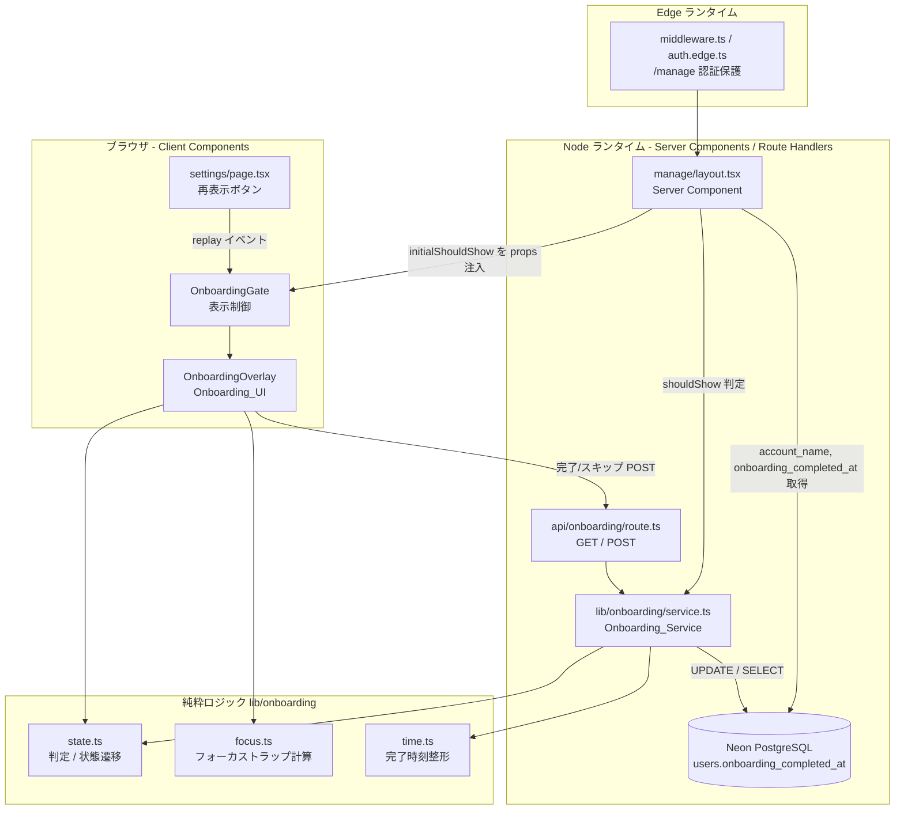
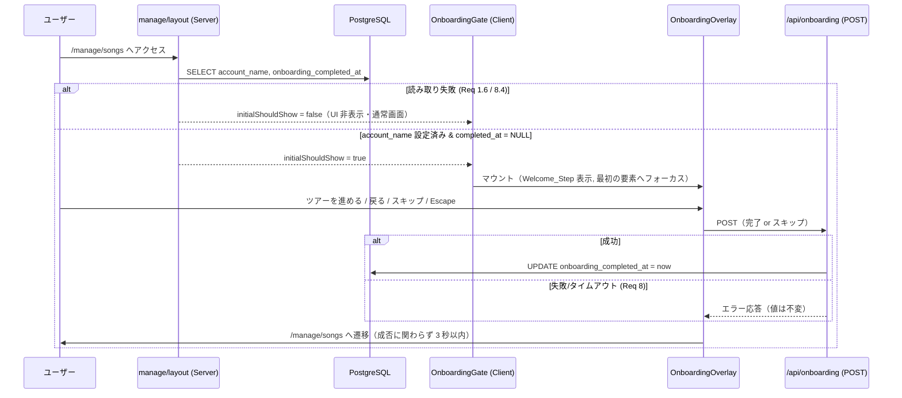

# 技術設計書: ユーザーオンボーディング

## Overview

本機能は、Part Prompter に新規ユーザー向けのオンボーディング体験を追加する。Google OAuth（NextAuth v5）でログインし、アカウント名設定（`/auth/setup`）を完了した直後の新規ユーザーに対し、`/manage/*` 配下でウェルカム画面 → 5 ステップの機能紹介ツアー → 最初のアクション誘導を表示する。完了・スキップの状態は `users.onboarding_completed_at`（TIMESTAMP）に永続化し、複数端末で重複表示されないようにする。既存ユーザー（本機能リリース前から存在するアカウント）には表示しない。

設計の中心は、**表示要否の判定・完了状態の永続化を担うサーバー側ロジック（Onboarding_Service）** と、**ウェルカム/ツアー/誘導を表示し、アクセシビリティ要件を満たすクライアント側オーバーレイ（Onboarding_UI）** の分離である。判定・ナビゲーション・フォーカス制御・タイムスタンプ整形といった「純粋ロジック」を I/O から切り離し、プロパティベーステストで正しさを担保する。

### 設計上の主要判断と根拠

| 判断 | 内容 | 根拠 |
|------|------|------|
| 表示判定はサーバー（manage レイアウト）で実施 | 既存 `src/app/manage/layout.tsx` が既に `account_name` を取得しているため、同一クエリで `onboarding_completed_at` も取得し、判定結果をクライアントへ受け渡す | 追加の往復を避け、Req 1.2 の「到達後 3 秒以内」を確実に満たす |
| 既存ユーザーはマイグレーション時にバックフィル | カラム追加が初めて行われたときに限り、既存全行へ `onboarding_completed_at` を記録 | カラム追加直後は新規・既存が区別不能になるため。Req 1.5 / 6.2 / 6.3 |
| 完了/スキップ/再表示完了はすべて単一の POST に集約 | `onboarding_completed_at` をサーバー基準の現在時刻で UPDATE | Req 4・5・6・7 の記録要求を一貫した冪等操作で表現 |
| オーバーレイ（モーダル）方式で実装 | ページ遷移ではなく `/manage/*` 上に重ねて表示 | フォーカストラップ・Escape・離脱時の値保持（Req 7.4・9.4）を制御しやすい |
| 純粋ロジックを `src/lib/onboarding/` に分離 | 判定・状態遷移・フォーカス計算・時刻整形を副作用なしの関数に | プロパティベーステストでの検証を可能にする |

### AGENTS.md に基づく設計上の注意

本リポジトリの `AGENTS.md` は「この Next.js は独自版であり、API・規約・ファイル構成が一般的な知識と異なる可能性があるため、実装前に `node_modules/next/dist/docs/` 内の該当ガイドを参照すること」を指示している。実装フェーズでは、Route Handler（`route.ts`）・Server Component / Client Component の境界・`redirect`/`searchParams` の挙動について、当該バージョンのバンドル済みドキュメントを確認したうえでコードを記述する。本設計はその前提で、既存コードベースで実証済みのパターン（`src/app/api/user/route.ts` の Route Handler、`src/app/manage/layout.tsx` の Server Component による `auth()` + `query()`、`SessionProvider` 配下の `useSession`）にのみ依拠する。

## Architecture

### 全体構成



### 表示フロー（新規ユーザー）



### ランタイム分離に関する注意

`middleware.ts` は `auth.edge.ts`（Edge ランタイム、`pg` 非依存）を用いる。本機能の DB アクセス（判定・記録）はすべて Node ランタイム側（Server Component の `manage/layout.tsx` と Route Handler `api/onboarding/route.ts`）で行い、`@/lib/db` の `query()` を使用する。middleware には一切のオンボーディング判定を持ち込まない（既存の認証保護のみ）。

## Components and Interfaces

### 1. データアクセス / マイグレーション（`src/lib/db.ts` 拡張）

`initDb()` に、`onboarding_completed_at` カラムの冪等追加と、初回追加時の既存ユーザーバックフィルを追加する。`ADD COLUMN IF NOT EXISTS` だけでは「今回初めて追加されたか」を判別できないため、`information_schema` でカラム存在を確認し、未存在のときのみバックフィルを実行する。

```typescript
// initDb() 内に追加（既存 users テーブル定義の後）
const col = await query(
  `SELECT 1 FROM information_schema.columns
   WHERE table_name = 'users' AND column_name = 'onboarding_completed_at'`
)
const columnExists = (col.rowCount ?? 0) > 0

await query(
  `ALTER TABLE users ADD COLUMN IF NOT EXISTS onboarding_completed_at TIMESTAMP`
)

if (!columnExists) {
  // カラムが今回初めて追加された＝この時点の全ユーザーは Existing_User。
  // オンボーディング対象外とするため完了済みにバックフィルする (Req 1.5 / 6.2 / 6.3)
  await query(
    `UPDATE users SET onboarding_completed_at = CURRENT_TIMESTAMP
     WHERE onboarding_completed_at IS NULL`
  )
}
```

備考: 既存 `initDb()` は全体を `try/catch` で握りつぶしているため、マイグレーション失敗時もアプリ起動は継続する。既にカラムが存在する場合、`ADD COLUMN IF NOT EXISTS` は何もせず既存値を保持する（Req 6.3）。

### 2. Onboarding_Service（`src/lib/onboarding/service.ts`）

サーバー側で DB と純粋ロジックを橋渡しする。I/O を伴うため、タイムアウト・例外を扱う。

```typescript
import { query } from '@/lib/db'
import { shouldShowOnboarding } from './state'
import { formatCompletionTimestamp } from './time'

const READ_TIMEOUT_MS = 5000
const WRITE_TIMEOUT_MS = 5000

export interface OnboardingStatus {
  shouldShow: boolean
  completedAt: string | null
  error: boolean // 取得失敗時 true（UI は非表示・通常利用）
}

/** email から判定材料を取得し、表示要否を返す。失敗時は error:true・shouldShow:false */
export async function getOnboardingStatus(email: string): Promise<OnboardingStatus>

/** 完了/スキップ/再表示完了を記録。成功時 completedAt を返す。失敗時は throw せず ok:false */
export async function recordOnboardingComplete(
  email: string
): Promise<{ ok: boolean; completedAt: string | null }>
```

- `getOnboardingStatus`: `SELECT account_name, onboarding_completed_at FROM users WHERE email = $1` を `Promise.race` でタイムアウト管理（Req 8.4）。取得した値を純粋関数 `shouldShowOnboarding()` に渡して判定（Req 1.1〜1.5・5.5・6.4）。例外/タイムアウト時は `console.error` で記録し `{ shouldShow:false, completedAt:null, error:true }` を返す（Req 1.6・6.6）。
- `recordOnboardingComplete`: `UPDATE users SET onboarding_completed_at = $1 WHERE email = $2` を実行。成功で `formatCompletionTimestamp(new Date())` を返す。失敗/タイムアウト時は値を変更せず `{ ok:false, completedAt:null }`（Req 6.5・7.5・8.3）。UPDATE は単一文のため、失敗時に部分的に値が変わることはない。

### 3. 純粋ロジック: 表示判定・状態遷移（`src/lib/onboarding/state.ts`）

副作用を持たない。Onboarding_Service と Onboarding_UI の双方から利用する。

```typescript
/** 表示判定の入力（DB から取得した生の値を正規化したもの） */
export interface OnboardingUser {
  accountName: string | null
  onboardingCompletedAt: string | null
}

/** account_name 設定済み かつ 未完了 のときのみ true (Req 1.2-1.5, 5.5, 6.4) */
export function shouldShowOnboarding(user: OnboardingUser): boolean

/** オーバーレイの表示状態 */
export type OnboardingView =
  | { kind: 'welcome' }
  | { kind: 'tour'; step: number } // step: 1..TOUR_TOTAL
  | { kind: 'finalAction' }

export const TOUR_TOTAL = 5

/** 5 つの Tour_Step を Req 3.1 の順序で定義 */
export interface TourStepContent {
  index: number // 1..5
  title: string
  body: string
  howToUseHref: string // '/how-to-use' への導線 (Req 3.8)
}
export const TOUR_STEPS: readonly TourStepContent[]

/** 「次へ」遷移 (Req 2.5, 3.3, 3.4) */
export function nextView(view: OnboardingView): OnboardingView
/** 「戻る」遷移 (Req 3.6)。welcome / tour step 1 では戻れず同一 view を返す (Req 3.7) */
export function prevView(view: OnboardingView): OnboardingView
/** 戻る操作要素を表示すべきか (Req 3.5, 3.7) */
export function canGoBack(view: OnboardingView): boolean
/** 「現在/総数」表示用。tour のときのみ {current, total} を返す (Req 3.2) */
export function tourProgress(view: OnboardingView): { current: number; total: number } | null
```

遷移仕様:
- `welcome` --next--> `tour step 1`（Req 2.5）
- `tour step n (n<5)` --next--> `tour step n+1`（Req 3.3）
- `tour step 5` --next--> `finalAction`（Req 3.4）
- `finalAction` --next--> （遷移なし。完了操作で UI を閉じる）
- `tour step n (n>=2)` --prev--> `tour step n-1`（Req 3.6）
- `welcome` / `tour step 1` --prev--> 自身（戻れない、Req 3.7）

### 4. 純粋ロジック: フォーカストラップ（`src/lib/onboarding/focus.ts`）

```typescript
/**
 * フォーカス可能要素のインデックス配列に対し、Tab/Shift+Tab の次フォーカス位置を計算。
 * 末尾で Tab → 先頭、先頭で Shift+Tab → 末尾 にラップする (Req 9.4)。
 * @param current 現在フォーカス中のインデックス（0..count-1）
 * @param count   フォーカス可能要素数（>=1）
 * @param shift   Shift+Tab なら true
 * @returns 次にフォーカスすべきインデックス（0..count-1）
 */
export function nextFocusIndex(current: number, count: number, shift: boolean): number
```

### 5. 純粋ロジック: 完了時刻整形（`src/lib/onboarding/time.ts`）

```typescript
/** Date を UTC・ISO 8601・ミリ秒精度の文字列へ整形 (Req 6.1)。例: 2025-01-01T12:34:56.789Z */
export function formatCompletionTimestamp(date: Date): string
```

### 6. Route Handler（`src/app/api/onboarding/route.ts`）

既存 `src/app/api/user/route.ts` のパターン（`auth()` による認可 → `query()`）に従う。

```typescript
// GET /api/onboarding → 表示要否（再表示前の状態確認等に利用）
//   200 { shouldShow, completedAt } / 401 未認証 / 200 { shouldShow:false, error:true }（取得失敗, Req 8.4）
export async function GET(): Promise<Response>

// POST /api/onboarding → 完了/スキップ/再表示完了を記録 (Req 4.2-4.3, 5.2, 6.1, 7.3)
//   200 { ok:true, completedAt } / 401 未認証 / 200 { ok:false }（保存失敗, Req 6.5/8.3。HTTP は 200 で ok フラグ伝達）
export async function POST(): Promise<Response>
```

保存失敗時に HTTP エラーではなく `{ ok:false }` を返すのは、UI 側が「失敗メッセージ表示 + 管理画面遷移」（Req 8.1・8.2）へ確実に分岐できるようにするため。クライアントはネットワーク例外も同様に失敗として扱う。

### 7. OnboardingGate（`src/components/onboarding/OnboardingGate.tsx`, Client）

`manage/layout.tsx`（Server Component）から `initialShouldShow: boolean` を props で受け取り、表示制御を行う。`SessionProvider` は既に `src/app/layout.tsx` で全体に適用済み。

責務:
- `initialShouldShow === true` で `OnboardingOverlay` を表示開始。
- 設定画面からの再表示イベント（`window` の `CustomEvent('onboarding:replay')`）を購読し、表示を再開（Req 7.2、1000ms 以内。再マウントのみで往復不要）。
- オーバーレイを開く直前に `document.activeElement` を保存し、閉じる際に復元（Req 9.7 のフォーカス復帰の保持先）。

```typescript
export function OnboardingGate({ initialShouldShow }: { initialShouldShow: boolean }): JSX.Element
```

`manage/layout.tsx` 側の変更（抜粋）:

```typescript
const result = await query(
  `SELECT account_name, onboarding_completed_at FROM users WHERE email = $1`,
  [session.user.email]
)
const accountName = result.rows[0]?.account_name
if (!accountName) redirect('/auth/setup')

// 取得失敗時は query() が例外 → 別途 try/catch で initialShouldShow=false に倒す
const initialShouldShow = shouldShowOnboarding({
  accountName,
  onboardingCompletedAt: result.rows[0]?.onboarding_completed_at ?? null,
})
// ...
<OnboardingGate initialShouldShow={initialShouldShow} />
```

### 8. OnboardingOverlay（`src/components/onboarding/OnboardingOverlay.tsx`, Client）

Onboarding_UI 本体。`role="dialog"` `aria-modal="true"` のモーダル。CSS Modules（`OnboardingOverlay.module.css`）でスタイル。

責務と要件対応:
- `view` 状態（`OnboardingView`）を保持し、`nextView`/`prevView` で遷移。
- Welcome（Req 2）: 歓迎メッセージ・「Part Prompter」・目的説明・次へ・スキップを同時表示。
- Tour（Req 3）: タイトル/本文、`tourProgress()` で「現在/総数」表示、戻る（`canGoBack`）、次へ、スキップ、`/how-to-use` 導線。
- FinalAction（Req 4）: 「楽曲を追加」CTA（→ 記録要求後 `/manage/songs` へ。Req 4.2）と「完了」（Req 4.3）をラベル付きで表示。
- スキップ要素を全 view で常時表示・操作可能（Req 5.1）。
- マウント時に最初の操作要素へフォーカス（Req 9.3）。
- `nextFocusIndex` を用いた Tab/Shift+Tab のフォーカストラップ（Req 9.2・9.4）、可視フォーカス表示（Req 9.5、CSS `:focus-visible`）。
- Escape で完了記録 → UI を閉じ → 直前要素へフォーカス復帰（Req 9.7）。
- 完了/スキップ/CTA 操作時は `POST /api/onboarding` を呼び、成否に関わらず 3 秒以内に `/manage/songs` を表示（Req 4.4・5.3・8.1）。保存失敗時は遷移後に失敗メッセージを表示（Req 8.2）。
- レスポンシブ（Req 9.1・9.6）は CSS Modules のメディアクエリで対応（最小 44×44px のタッチターゲット、320–1920px で横スクロールなし）。

```typescript
export function OnboardingOverlay({
  onClose, // 完了/スキップ後に Gate へ通知（フォーカス復帰＋アンマウント）
}: {
  onClose: () => void
}): JSX.Element
```

### 9. 設定画面の再表示導線（`src/app/manage/settings/page.tsx` 拡張）

「オンボーディングをもう一度見る」ボタンを常時表示（Req 7.1）。クリックで `window.dispatchEvent(new CustomEvent('onboarding:replay'))` を発火し、`OnboardingGate` が表示を再開する（Req 7.2）。再表示中に完了/スキップすれば POST で現在時刻に更新（Req 7.3）、完了/スキップせず閉じた場合（離脱）は POST せず既存値を保持（Req 7.4）。

> セキュリティ補足: `/api/onboarding` は `auth()` セッション必須（未認証は 401）。`email` をキーに自分のレコードのみ更新するため、他ユーザーの状態は変更できない。既存 `/api/user` と同一の認可方針。

## Data Models

### users テーブル（既存に 1 カラム追加）

| カラム | 型 | 既定 | 説明 |
|--------|-----|------|------|
| id | SERIAL PK | — | 既存 |
| google_id | TEXT UNIQUE NOT NULL | — | 既存 |
| email | TEXT | — | 既存。判定・記録のキー |
| account_name | TEXT | NULL | 既存。空文字/NULL は未設定 |
| created_at | TIMESTAMP | CURRENT_TIMESTAMP | 既存 |
| **onboarding_completed_at** | **TIMESTAMP** | **NULL** | **追加。NULL=未完了、日時=完了済み** |

状態の意味:
- `account_name` が空文字でも NULL でもない、かつ `onboarding_completed_at IS NULL` → **New_User（表示対象）**
- `onboarding_completed_at IS NOT NULL` → 完了済み（非表示）
- 既存ユーザーはマイグレーションのバックフィルで `onboarding_completed_at` に値が入る（非表示）

### クライアント側ドメインモデル

```typescript
// 表示状態（state.ts）
type OnboardingView =
  | { kind: 'welcome' }
  | { kind: 'tour'; step: number } // 1..5
  | { kind: 'finalAction' }

// API レスポンス
interface OnboardingStatusResponse { shouldShow: boolean; completedAt: string | null; error?: boolean }
interface OnboardingCompleteResponse { ok: boolean; completedAt: string | null }
```

### Tour_Step 定義（Req 3.1 の固定順序）

| index | title | 内容 |
|-------|-------|------|
| 1 | 楽曲の追加 | LRCLIB による歌詞取得を含む |
| 2 | パート分けの作成 | メンバー割り当て |
| 3 | プロンプター表示 | 本番表示 |
| 4 | セットリスト管理 | 曲順管理 |
| 5 | 楽曲の出力 | PPTX・印刷/PDF |

## Correctness Properties

*プロパティ（性質）とは、システムのすべての有効な実行において成り立つべき特性・振る舞いであり、システムが何をすべきかについての形式的な言明である。プロパティは人間が読む仕様と、機械が検証可能な正しさ保証との橋渡しとなる。*

本機能では、表示判定・ステップ遷移・フォーカストラップ・完了時刻整形といった**純粋ロジック**をプロパティベーステストで検証する。DB マイグレーション・I/O 失敗パス・タイミング・CSS レイアウト・DOM フォーカスといった要件は、プロパティベーステストではなく統合テスト／単体（example）テストで担保する（Testing Strategy 参照）。

事前分析（prework）で重複を排除した結果、以下の 6 プロパティに集約した。

### Property 1: 表示判定はアカウント名設定済みかつ未完了のときのみ真

*For any* `accountName`（NULL・空文字・空白のみ・任意の非空文字列）および `onboardingCompletedAt`（NULL・任意の日時文字列）の組み合わせについて、`shouldShowOnboarding({accountName, onboardingCompletedAt})` は、`accountName` が NULL でも空文字でもなく（トリム後 1 文字以上）、かつ `onboardingCompletedAt` が NULL である場合に限り `true` を返し、それ以外では `false` を返す。

**Validates: Requirements 1.2, 1.3, 1.4, 1.5, 5.5, 6.4**

### Property 2: ステップ遷移の前進と戻りの整合性

*For any* `OnboardingView`（`welcome`、`tour step 1..5`、`finalAction`）について、`nextView` は `welcome → tour step 1`、`tour step n (1≤n<5) → tour step n+1`、`tour step 5 → finalAction` の順序で前進する。また、戻る操作が可能な任意の view（`tour step n, 2≤n≤5`）について `prevView(nextView)` を含む前進・後退は直前のステップへ戻り、得られる `tour step` は常に 1 以上 5 以下に収まる。

**Validates: Requirements 2.5, 3.3, 3.4, 3.6**

### Property 3: 戻る操作要素の表示可否

*For any* `OnboardingView` について、`canGoBack(view)` は view が `tour step n (n≥2)` のときに限り `true` を返し、`welcome` および `tour step 1`、`finalAction` では `false` を返す。

**Validates: Requirements 3.5, 3.7**

### Property 4: ツアー進捗表示は現在ステップと総数5を反映

*For any* `tour step n (1≤n≤5)` について、`tourProgress(view)` は `{ current: n, total: 5 }` を返し、`total` は常に `TOUR_TOTAL`（=5）に等しい。`welcome` および `finalAction` では `null` を返す。

**Validates: Requirements 3.2**

### Property 5: フォーカストラップのラップ計算

*For any* 整数 `current`（0 ≤ current ≤ count-1）、`count`（count ≥ 1）、および `shift`（真偽）について、`nextFocusIndex(current, count, shift)` は常に 0 以上 count-1 以下の値を返し、`shift=false` かつ `current=count-1` のときは `0`（先頭へラップ）、`shift=true` かつ `current=0` のときは `count-1`（末尾へラップ）を返す。それ以外では `shift=false` で `current+1`、`shift=true` で `current-1` を返す。

**Validates: Requirements 9.4**

### Property 6: 完了時刻整形の往復一致と形式

*For any* 有効な `Date` について、`formatCompletionTimestamp(date)` は UTC・ISO 8601・ミリ秒精度の文字列（`YYYY-MM-DDTHH:mm:ss.sssZ` 形式）を返し、その文字列を `new Date(...)` で解釈して再度整形した結果は元の出力と一致する（ラウンドトリップが恒等）。

**Validates: Requirements 6.1, 7.3**

## Error Handling

オンボーディングは補助的な体験であり、いかなる失敗もユーザーの本来作業（管理画面の利用）を妨げてはならない、という方針を貫く。

### 取得（判定）失敗

- **対象 Req**: 1.6・6.6・8.4
- **挙動**: `manage/layout.tsx` の `SELECT` および `getOnboardingStatus` を `try/catch` と 5 秒タイムアウト（`Promise.race`）で保護する。例外・タイムアウト時は `console.error` でエラー記録を試み、`initialShouldShow = false` に倒す。`onboarding_completed_at` は SELECT のみのため値は変化しない。Onboarding_UI もエラーメッセージも表示せず、管理画面を通常どおりレンダリングする。

### 記録（完了/スキップ/再表示）失敗

- **対象 Req**: 5.4・6.5・7.5・8.1・8.2・8.3
- **挙動**: `recordOnboardingComplete` は `UPDATE` を 5 秒タイムアウトで実行。失敗・タイムアウト時は値を変更せず `{ ok:false }` を返す（単一文 UPDATE のため部分更新は発生しない＝次回再実施可能を保持）。Route Handler は HTTP 200 + `{ ok:false }` で失敗を伝える。Onboarding_UI は失敗確定後 3 秒以内に `/manage/songs` へ遷移し（Req 8.1）、遷移完了後 1 秒以内に保存失敗メッセージを表示、ユーザーの閉じる操作または最長 10 秒で消す（Req 8.2）。再表示（Req 7.5）の場合は失敗メッセージを表示しつつ既存値を保持する。

### Tour 表示不能（防御的処理）

- **対象 Req**: 2.7
- **挙動**: `TOUR_STEPS` は固定 5 件のため通常は発生しないが、何らかの理由で表示可能ステップが 0 件の場合、Onboarding_UI はオンボーディングを終了して管理画面へ遷移し、Tour を表示できない旨のエラー表示を行う。

### 未認証

- `/api/onboarding` は `auth()` セッション必須。未認証時は 401 を返す（既存 `/api/user` と同一方針）。`email` をキーに自分のレコードのみ操作するため、他ユーザー状態は変更不可。

### マイグレーション失敗

- **対象 Req**: 6.2・6.3
- **挙動**: `initDb()` 全体が既存の `try/catch` で保護されており、`information_schema` 確認・`ADD COLUMN IF NOT EXISTS`・バックフィルのいずれが失敗してもアプリ起動は継続する。カラムが既存の場合 `ADD COLUMN IF NOT EXISTS` は無操作で既存値を保持する。

## Testing Strategy

### 方針

純粋ロジック（`src/lib/onboarding/state.ts`・`focus.ts`・`time.ts`）はプロパティベーステストで網羅的に検証し、I/O・タイミング・UI レンダリング・DB マイグレーションは単体（example）テストおよび統合テストで検証する二層構成とする。

本リポジトリには現状テストフレームワークが導入されていない（`package.json` に test スクリプトなし）。実装フェーズで、Next.js 15 / React 19 / TypeScript と整合する標準的な構成として **Vitest**（テストランナー）＋ **fast-check**（プロパティベーステスト）＋ **@testing-library/react**（コンポーネント）を導入する。プロパティベーステストはゼロから自作せず fast-check を用いる。実行はウォッチモードを避け、単発実行（例: `vitest --run`）を CI/ローカルで使用する。

> 注: AGENTS.md の指示に従い、テスト設定やコンポーネント実装の前に当該 Next.js バージョンのバンドル済みドキュメントを参照する。

### プロパティテスト（fast-check）

- 各プロパティテストは最低 100 回の反復（`numRuns: 100` 以上）で実行する。
- 各テストには対応する設計プロパティを参照するコメントタグを付す。
  - タグ形式: `// Feature: user-onboarding, Property {番号}: {プロパティ本文}`
- 各 Correctness Property を 1 本のプロパティテストで実装する。

| Property | 対象モジュール | ジェネレータの要点 |
|----------|----------------|--------------------|
| 1 表示判定 | `state.shouldShowOnboarding` | accountName: NULL/空/空白のみ/非空文字列、completedAt: NULL/任意 ISO 文字列 |
| 2 ステップ遷移 | `state.nextView` / `prevView` | 全 view（welcome/tour 1..5/finalAction）を列挙生成 |
| 3 canGoBack | `state.canGoBack` | 全 view を列挙生成 |
| 4 tourProgress | `state.tourProgress` | tour step 1..5＋welcome/finalAction |
| 5 フォーカスラップ | `focus.nextFocusIndex` | count: 1..50、current: 0..count-1、shift: bool |
| 6 完了時刻整形 | `time.formatCompletionTimestamp` | 任意の Date（過去〜未来、ミリ秒含む） |

### 単体（example）テスト

- 初期 view が `welcome`（Req 2.1）。
- Welcome レンダリングに歓迎文（1–200 文字）・「Part Prompter」・目的説明（1–500 文字）・進む・スキップが含まれる（Req 2.2–2.4）。
- `TOUR_STEPS` が 5 件で、index 1..5 が「楽曲追加 / パート分け / プロンプター / セットリスト / 出力」の順（Req 3.1）。
- 各 view（welcome/tour/finalAction）にスキップ要素が存在（Req 5.1）、Tour に `/how-to-use` 導線が存在（Req 3.8）、finalAction に CTA と完了がラベル付きで存在（Req 4.1）。
- 設定画面に再表示ボタンが存在（Req 7.1）、replay イベントで welcome から再表示（Req 7.2）。
- スキップ/完了/CTA で POST が呼ばれ `/manage/songs` へ遷移（Req 2.6・4.2–4.4・5.2–5.3）、保存成功/失敗の双方で遷移（Req 4.4・8.1）、失敗時にメッセージ表示と消去（Req 8.2）。
- 再表示を完了/スキップせず閉じた場合 POST を呼ばない（Req 7.4）。
- Escape で POST 呼び出し＋クローズ＋直前要素へフォーカス復帰（Req 9.7）、マウント時に最初の要素へフォーカス（Req 9.3）、Tab/Shift+Tab 到達と Enter/Space 実行（Req 9.2）、フォーカス時の可視表示（Req 9.5）。
- `TOUR_STEPS` が空の場合の防御分岐（Req 2.7、エッジケース）。

### 統合テスト

- `initDb()` 実行で `users.onboarding_completed_at` カラムが追加される。2 回実行してもエラーなく既存値を保持（Req 6.2・6.3）。
- カラム初回追加時、既存ユーザー行に `onboarding_completed_at` がバックフィルされ非 NULL になる（Req 1.5）。
- `query` をモックして読み取り失敗/タイムアウトを注入 → `getOnboardingStatus` が `{ shouldShow:false, error:true }` を返す（Req 1.6・6.6・8.4）。
- `query` をモックして UPDATE 失敗を注入 → `recordOnboardingComplete` が `{ ok:false }` を返し値不変（Req 6.5・7.5・8.3）。

### レスポンシブ / 視覚要件（手動・スナップショット）

- 320–1920px で横スクロールなしに収まる（Req 9.1）、SP 幅（320–767px）でタッチ対象 44×44px 以上（Req 9.6）、フォーカスの可視表示（Req 9.5）は CSS Modules のメディアクエリ・`:focus-visible` で実装し、代表幅のスナップショット／手動確認で検証する。完全なアクセシビリティ適合判定には支援技術での手動テストと専門家レビューが必要である。

### タイミング要件に関する注記

「3 秒以内」「2 秒以内」「1000ms 以内」等のタイミング要件（Req 1.2・2.1・4.4・5.3・7.2・8.1・8.2）は、本設計が往復を最小化（判定はレイアウトの既存クエリに同梱、再表示はクライアント再マウントのみ）していることで構造的に満たす。自動テストでは「遷移・表示が発生すること」を検証し、実時間の上限は実装後の手動／計測で確認する。

## Error Handling

純粋ロジック（`state.ts`/`focus.ts`/`time.ts`）は副作用を持たず例外経路を持たない。エラー処理は I/O 境界（Onboarding_Service・Route Handler・Onboarding_UI のフェッチ）に限定して扱う。

| ケース | 検出 | 挙動 | 関連要件 |
|--------|------|------|----------|
| 表示判定の DB 取得失敗・タイムアウト | `getOnboardingStatus` の `Promise.race`（5 秒）と `try/catch` | `console.error` 記録。`{ shouldShow:false, error:true }` を返し、オーバーレイもエラー表示も出さず通常画面を維持。`onboarding_completed_at` は変更しない | 1.6, 6.6, 8.4 |
| `manage/layout.tsx` の判定クエリ例外 | レイアウト内 `try/catch`（`redirect` は `try` 外で実施） | `initialShouldShow=false` に倒す | 1.6, 8.4 |
| 完了/スキップ記録の失敗・タイムアウト | `recordOnboardingComplete` の `try/catch`（5 秒） | DB を変更せず `{ ok:false }`。Route Handler は HTTP 200 + `{ ok:false }` で返す | 6.5, 8.3 |
| 記録失敗をクライアントが受信 | `POST /api/onboarding` の `ok:false` またはネットワーク例外 | 成否に関わらず 3 秒以内に `/manage/songs` へ遷移。遷移後 1 秒以内に保存失敗バナーを表示し、ユーザー操作または最長 10 秒で消去 | 8.1, 8.2 |
| マイグレーションでカラムが既存 | `information_schema` 確認 + `ADD COLUMN IF NOT EXISTS` | バックフィルをスキップし既存値を保持。失敗しても既存 `initDb()` の `try/catch` で起動継続 | 6.2, 6.3 |
| 再表示の更新失敗 | 同上（POST `ok:false`） | 失敗バナー表示。`onboarding_completed_at` は更新前の値を保持 | 7.5 |
| 再表示を完了/スキップせず離脱 | UI の閉じる経路で POST を発行しない | `onboarding_completed_at` を変更しない | 7.4 |
| Tour_Step が空（異常系） | UI マウント時に `TOUR_STEPS.length === 0` を確認 | オーバーレイを閉じて `/manage/songs` へ遷移し、Tour 表示不可のエラー表示 | 2.7 |

設計方針: 「保存失敗でもユーザーをブロックしない」ことを最優先とし、記録 API は HTTP エラーを投げず `ok` フラグで成否を伝える。これにより UI は単一経路でフェイルセーフ遷移を実装できる。

## Testing Strategy

本機能は純粋ロジックを `src/lib/onboarding/` に分離する設計のため、ロジックの正しさはプロパティベーステストで網羅的に検証し、I/O・UI は薄く保って手動／結合確認で補う。

> リポジトリにはテストランナーが未導入（`package.json` は dev/build/start/lint のみ）。本機能の実装タスクで開発依存に **Vitest** と **fast-check**（プロパティベース）を追加し、`test` スクリプトを定義する（`vitest run` による単発実行。watch モードは使わない）。導入可否はタスク着手時にユーザーへ確認する。

### プロパティベーステスト（純粋ロジック）

- `state.ts`
  - `shouldShowOnboarding`: `account_name` が非空かつ `completedAt` が NULL のときのみ true。それ以外は常に false（任意入力で不変）。（Property 1）
  - `nextView`/`prevView`: 任意の view から `next` を `TOUR_TOTAL` 回以内適用すると必ず `finalAction` に到達。`finalAction` で `next` は不動点。（Property 7）
  - `prevView`: `tour step n (n>=2)` → `n-1`。`welcome`/`tour step 1` は不動点。`next` の後に `prev` を適用すると元の view に戻る（`finalAction`→`tour 5` を除き往復整合）。（Property 8）
  - `tourProgress`: tour のとき `1 <= current <= total` かつ `total === TOUR_TOTAL`。非 tour では null。（Property 9）
- `focus.ts`
  - `nextFocusIndex`: 戻り値は常に `0 <= i < count` の範囲内。末尾で Tab → 0、先頭で Shift+Tab → `count-1` にラップ。（Property 6）
- `time.ts`
  - `formatCompletionTimestamp`: 出力は常に UTC・ミリ秒精度の ISO 8601（`...Z`）にマッチし、`new Date(out).getTime() === date.getTime()`（往復一致）。（Property 5）

### 例示ベース／結合テスト

- `service.ts`（`query` をモック）: 取得失敗時に `error:true, shouldShow:false`、記録失敗時に `ok:false` で値不変を返すこと。
- Route Handler: 未認証で 401、記録失敗で HTTP 200 + `ok:false`。

### 手動検証シナリオ（受け入れ基準対応）

1. 新規ユーザーで `/auth/setup` 完了 → `/manage/songs` で Welcome から表示（R1, R2）。
2. ツアー 1→5 の前進・後退、進捗「n/5」、`/how-to-use` 導線（R3）。
3. 最終ステップの「楽曲を追加」「完了」で記録 → `/manage/songs`（R4）。
4. 各ステップでスキップ → 記録 → 再アクセスで非表示（R5, R6.4）。
5. 別端末ログインで非表示（R6）。
6. 設定画面「もう一度見る」で Welcome から再表示、完了で日時更新、離脱で値保持（R7）。
7. 記録 API を擬似失敗させ、遷移継続＋バナー＋次回再表示（R8）。
8. 既存ユーザー（バックフィル済み）で非表示（R1.5）。
9. キーボードのみ操作（Tab/Shift+Tab/Enter/Space/Esc）、フォーカストラップ、320px/SP で崩れなし・タッチ対象 44px（R9）。

## Correctness Properties

純粋ロジックが満たすべき不変条件。プロパティベーステストで検証する。

### Property 1: 新規ユーザーのみ表示判定が true
`shouldShowOnboarding` は `accountName` が非空文字かつ `onboardingCompletedAt` が null のときのみ true を返し、それ以外（account_name 未設定・完了済み・両方）では常に false。
**Validates: Requirements 1.2, 1.3, 1.4, 1.5, 5.5, 6.4**

### Property 2: 冪等マイグレーション
`information_schema` 判定により、`onboarding_completed_at` の追加とバックフィルは初回のみ行われ、再実行で既存の完了日時を上書きしない。
**Validates: Requirements 6.2, 6.3**

### Property 3: 自動表示の単調性
`onboarding_completed_at` が一度非 null になると `shouldShowOnboarding` は二度と true を返さない（再表示は設定画面の明示操作のみ）。
**Validates: Requirements 5.5, 6.3, 6.4**

### Property 4: 記録のフェイルセーフ
`recordOnboardingComplete` および `getOnboardingStatus` は失敗時に例外を伝播させず、DB の値を変更しないままフォールバック値（`ok:false` / `error:true`）を返す。
**Validates: Requirements 6.5, 8.1, 8.3, 8.4**

### Property 5: 完了時刻の往復一致
`formatCompletionTimestamp(date)` は常に UTC・ミリ秒精度の ISO 8601 文字列を返し、`new Date(result)` が元の時刻と一致する。
**Validates: Requirements 6.1**

### Property 6: フォーカストラップのラップ
`nextFocusIndex` の戻り値は常に `[0, count)` の範囲に収まり、末尾での Tab は先頭へ、先頭での Shift+Tab は末尾へラップする。
**Validates: Requirements 9.2, 9.4**

### Property 7: ツアー前進の終端到達
任意の view から `nextView` を最大 `TOUR_TOTAL` 回適用すると `finalAction` に到達し、`finalAction` での `nextView` は不動点である。
**Validates: Requirements 2.5, 3.3, 3.4**

### Property 8: 前後遷移の整合
`prevView` は `tour step n (n>=2)` を `n-1` に移し、`welcome` と `tour step 1` では不動点となる。`finalAction` 以外の view で `nextView` 後に `prevView` を適用すると元の view に戻る。
**Validates: Requirements 3.5, 3.6, 3.7**

### Property 9: 進捗表示の範囲
`tourProgress` は tour view のとき `1 <= current <= total` かつ `total === TOUR_TOTAL` を満たし、非 tour view では null を返す。
**Validates: Requirements 3.2**
