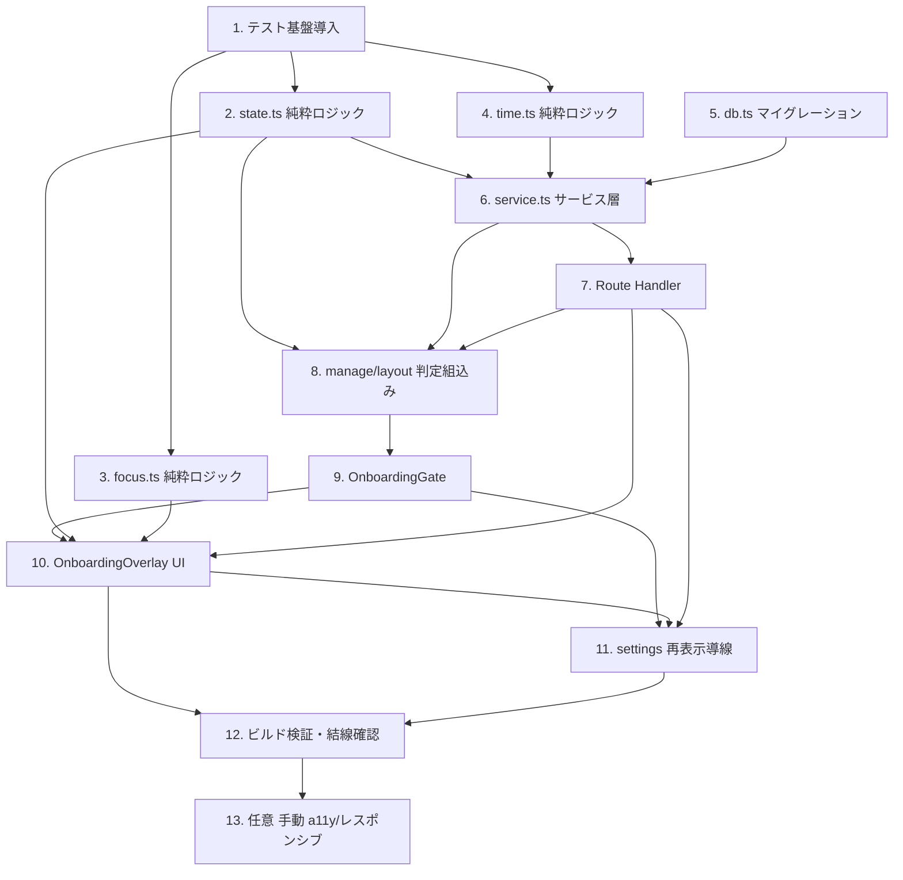

# Implementation Plan: ユーザーオンボーディング

## Overview

ログイン後オンボーディング機能の実装計画。純粋ロジック（state/focus/time）を先に実装してプロパティベーステストで固め、続いてデータ層マイグレーション・サーバーサービス・Route Handler・サーバー判定・クライアント UI・設定画面導線を結線する。最後にビルド検証と任意の手動 a11y/レスポンシブ確認を行う。設計書（design.md）と要件定義書（requirements.md）に厳密に対応する。

## Tasks

- [x] 1. テスト基盤の導入（Vitest + fast-check）
  - `package.json` の devDependencies に `vitest`、`fast-check`、`@testing-library/react`、`@testing-library/jest-dom`、`jsdom` を追加する
  - `package.json` の scripts に `"test": "vitest run"` を追加（watch モードは使わない）
  - `vitest.config.ts` を作成し、`@` パスエイリアス（`src` へのマッピング）と `environment: 'jsdom'` を設定する
  - インストール後に空のサンプルテストで `npm run test` が起動することを確認する
  - _Requirements: 全要件のテスト前提_

- [x] 2. 純粋ロジック: 状態・遷移（`src/lib/onboarding/state.ts`）
- [x] 2.1 型・定数・ツアーステップ定義を実装する
  - `OnboardingUser`、`OnboardingView`（`welcome` / `tour(step)` / `finalAction`）、`TourStepContent` 型を定義する
  - `TOUR_TOTAL = 5` と、design の Tour_Step 定義（楽曲追加/パート分け/プロンプター/セットリスト/出力）の固定順序で `TOUR_STEPS` を実装する。各ステップに `/how-to-use` への導線 `howToUseHref` を持たせる
  - _Requirements: 3.1, 3.8_
- [x] 2.2 判定関数 `shouldShowOnboarding` を実装する
  - `accountName` がトリム後 1 文字以上、かつ `onboardingCompletedAt` が null のときのみ true を返す
  - _Requirements: 1.2, 1.3, 1.4, 1.5, 5.5, 6.4_
  - _Properties: 1_
- [x] 2.3 遷移・進捗関数を実装する
  - `nextView`（welcome→tour1、tour n<5→n+1、tour5→finalAction、finalAction は不動点）
  - `prevView`（tour n≥2→n-1、welcome / tour1 / finalAction は不動点）
  - `canGoBack`（tour n≥2 のみ true）
  - `tourProgress`（tour のとき `{current, total: TOUR_TOTAL}`、それ以外 null）
  - _Requirements: 2.5, 3.2, 3.3, 3.4, 3.5, 3.6, 3.7_
  - _Properties: 2, 3, 4_
- [x] 2.4 state.ts のプロパティベーステストを実装する（`src/lib/onboarding/state.test.ts`）
  - Property 1: 任意の `accountName`（null/空/空白のみ/非空）と `onboardingCompletedAt`（null/任意文字列）で判定が仕様どおり
  - Property 2: 任意 view から `nextView` を最大 5 回で `finalAction` 到達、`nextView` 後に `prevView` で往復一致（finalAction 除く）、tour step は 1..5 に収束
  - Property 3: `canGoBack` は tour n≥2 のみ true
  - Property 4: `tourProgress` は tour で `current=n, total=5`、非 tour で null
  - 各テストにタグ `// Feature: user-onboarding, Property N: ...` を付与し `numRuns: 100` 以上
  - _Properties: 1, 2, 3, 4_

- [x] 3. 純粋ロジック: フォーカストラップ（`src/lib/onboarding/focus.ts`）
- [x] 3.1 `nextFocusIndex(current, count, shift)` を実装する
  - 戻り値は常に `[0, count)`。末尾で Tab→0、先頭で Shift+Tab→count-1 にラップ。それ以外は ±1
  - _Requirements: 9.2, 9.4_
  - _Properties: 5_
- [x] 3.2 focus.ts のプロパティベーステストを実装する（`src/lib/onboarding/focus.test.ts`）
  - Property 5: count(1..50)・current(0..count-1)・shift(bool) の任意組合せで範囲とラップを検証
  - タグ付与・`numRuns: 100` 以上
  - _Properties: 5_

- [x] 4. 純粋ロジック: 完了時刻整形（`src/lib/onboarding/time.ts`）
- [x] 4.1 `formatCompletionTimestamp(date)` を実装する
  - UTC・ISO 8601・ミリ秒精度（`YYYY-MM-DDTHH:mm:ss.sssZ`）の文字列を返す
  - _Requirements: 6.1, 7.3_
  - _Properties: 6_
- [x] 4.2 time.ts のプロパティベーステストを実装する（`src/lib/onboarding/time.test.ts`）
  - Property 6: 任意の Date で形式適合と `new Date(out)` ラウンドトリップ恒等を検証
  - タグ付与・`numRuns: 100` 以上
  - _Properties: 6_

- [x] 5. データ層マイグレーション（`src/lib/db.ts` 拡張）
  - `initDb()` 内に、`information_schema.columns` で `users.onboarding_completed_at` の存在を確認する処理を追加する
  - `ALTER TABLE users ADD COLUMN IF NOT EXISTS onboarding_completed_at TIMESTAMP` を実行する
  - カラムが今回初めて追加された場合のみ、既存ユーザーを `UPDATE users SET onboarding_completed_at = CURRENT_TIMESTAMP WHERE onboarding_completed_at IS NULL` でバックフィルする（既存ユーザー＝Existing_User を非表示扱いにする）
  - 既存の `try/catch` の挙動を維持し、マイグレーション失敗でも起動継続することを確認する
  - _Requirements: 1.5, 6.2, 6.3_
  - _Properties: 2_

- [x] 6. サーバーサービス層（`src/lib/onboarding/service.ts`）
- [x] 6.1 `getOnboardingStatus(email)` を実装する
  - `SELECT account_name, onboarding_completed_at FROM users WHERE email = $1` を 5 秒タイムアウト（`Promise.race`）で実行
  - 取得値を `shouldShowOnboarding` に渡し `{ shouldShow, completedAt, error:false }` を返す
  - 例外/タイムアウト時は `console.error` で記録し `{ shouldShow:false, completedAt:null, error:true }` を返す（値は変更しない）
  - _Requirements: 1.1, 1.6, 6.4, 6.6, 8.4_
  - _Properties: 1, 4(フェイルセーフ)_
- [x] 6.2 `recordOnboardingComplete(email)` を実装する
  - `UPDATE users SET onboarding_completed_at = CURRENT_TIMESTAMP WHERE email = $1` を 5 秒タイムアウトで実行
  - 成功時 `{ ok:true, completedAt }`、失敗/タイムアウト時は値を変更せず `{ ok:false, completedAt:null }` を返す（throw しない）
  - _Requirements: 6.1, 6.5, 7.3, 7.5, 8.3_
- [x] 6.3 service.ts の単体テストを実装する（`query` をモック）
  - 取得失敗注入で `{ shouldShow:false, error:true }`、UPDATE 失敗注入で `{ ok:false }` かつ値不変を検証
  - _Requirements: 6.5, 6.6, 8.3, 8.4_

- [x] 7. Route Handler（`src/app/api/onboarding/route.ts`）
  - 既存 `src/app/api/user/route.ts` の `auth()` 認可パターンに従う
  - `GET`: 未認証は 401。`getOnboardingStatus` の結果を `{ shouldShow, completedAt }`（取得失敗時は `{ shouldShow:false, error:true }`）で返す
  - `POST`: 未認証は 401。`recordOnboardingComplete` を呼び、成功で `{ ok:true, completedAt }`、保存失敗でも HTTP 200 + `{ ok:false }` を返す
  - `email` をキーに自分のレコードのみ操作することを確認する
  - _Requirements: 4.2, 4.3, 5.2, 6.1, 7.3, 8.1, 8.3, 8.4_
- [x] 7.1 Route Handler の単体テストを実装する
  - 未認証で 401、保存失敗で HTTP 200 + `{ ok:false }` を検証（service をモック）
  - _Requirements: 8.3_

- [x] 8. サーバー判定の組み込み（`src/app/manage/layout.tsx`）
  - 既存の `SELECT account_name ...` を `SELECT account_name, onboarding_completed_at ...` に拡張する
  - `account_name` 未設定時の `redirect('/auth/setup')` は `try` の外で行い、`redirect` の内部例外を握りつぶさない構成にする
  - 判定クエリを `try/catch` で保護し、失敗時は `initialShouldShow=false` に倒す（フェイルセーフ）
  - `shouldShowOnboarding` で `initialShouldShow` を算出し、`OnboardingGate` に props として渡して children を包む
  - _Requirements: 1.1, 1.2, 1.6, 8.4_
  - _Properties: 1, 4(フェイルセーフ)_

- [x] 9. クライアント表示制御（`src/components/onboarding/OnboardingGate.tsx`）
  - `'use client'` コンポーネント。props `initialShouldShow: boolean` を受け取り、true なら `OnboardingOverlay` を初期表示する
  - `window` の `CustomEvent('onboarding:replay')` を購読し、受信時に Welcome から表示を再開する（再マウント）。アンマウント時にリスナを解除する
  - オーバーレイを開く直前に `document.activeElement` を保存し、閉じる際に復元する（フォーカス復帰元）
  - オーバーレイの `onClose` で非表示に戻す
  - _Requirements: 1.1, 7.2, 9.7_
  - _Properties: 6(フォーカス閉包の保持先)_

- [x] 10. オーバーレイ UI 本体（`src/components/onboarding/OnboardingOverlay.tsx` + `OnboardingOverlay.module.css`）
- [x] 10.1 ステップ表示と画面構成を実装する
  - `view` ステート（`OnboardingView`）を保持し、`nextView`/`prevView` で遷移する
  - Welcome_Step: 歓迎メッセージ（≤200字）・「Part Prompter」・目的説明（≤500字）・「ツアーを開始」・「スキップ」を同時表示
  - Feature_Tour: `TOUR_STEPS` のタイトル/本文、`tourProgress()` で「n/5」表示、`canGoBack` のとき「戻る」、「次へ」、`/how-to-use` 導線リンク
  - 最終ステップ（finalAction）: 「楽曲を追加」CTA と「始める/完了」をラベル付きで表示
  - 全 view でスキップ要素を常時表示・操作可能にする
  - `TOUR_STEPS` が空の異常系では、オーバーレイを閉じて `/manage/songs` へ遷移しエラー表示する
  - _Requirements: 2.1, 2.2, 2.3, 2.4, 2.5, 2.7, 3.1, 3.2, 3.3, 3.4, 3.5, 3.6, 3.7, 3.8, 4.1, 5.1_
  - _Properties: 2, 3, 4, 7, 8, 9_
- [x] 10.2 完了/スキップの記録と遷移を実装する
  - 完了/スキップ/CTA/Esc 時に `completeOnboarding()` を呼ぶ：`POST /api/onboarding`（5 秒タイムアウト）→ 成否に関わらず 3 秒以内にオーバーレイを閉じ `router.replace('/manage/songs')`
  - 「楽曲を追加」CTA も完了記録後に `/manage/songs` へ遷移する
  - 保存失敗（`ok:false` またはネットワーク例外）時は、遷移後に非ブロッキングなバナーを表示し、ユーザー操作または最長 10 秒で自動消去する
  - 再表示中に完了/スキップせず閉じた場合は POST を発行しない（既存値保持）
  - _Requirements: 2.6, 4.2, 4.3, 4.4, 5.2, 5.3, 5.4, 7.3, 7.4, 8.1, 8.2_
  - _Properties: 5(完了記録の整合)_
- [x] 10.3 アクセシビリティとレスポンシブを実装する
  - `role="dialog"` `aria-modal="true"` `aria-labelledby` を付与する
  - マウント時に最初の操作要素へフォーカスする
  - `nextFocusIndex` を用いて Tab/Shift+Tab のフォーカストラップを実装し、Enter/Space で操作要素を実行可能にする
  - `Escape` で完了記録 → クローズ → 直前フォーカス要素へ復帰する
  - CSS Modules で 320–1920px の横スクロールなし、SP（320–767px）でタッチ対象 44×44px 以上、`:focus-visible` でフォーカス可視表示を実装する
  - _Requirements: 9.1, 9.2, 9.3, 9.4, 9.5, 9.6, 9.7_
  - _Properties: 6_

- [x] 11. 設定画面の再表示導線（`src/app/manage/settings/page.tsx` 拡張）
  - 「オンボーディングをもう一度見る」ボタンを常時表示する
  - クリックで `window.dispatchEvent(new CustomEvent('onboarding:replay'))` を発火する
  - _Requirements: 7.1, 7.2_

- [x] 12. ビルド検証と結線確認
  - `npm run test` で全プロパティ/単体テストが通ることを確認する
  - `npm run build` で型エラー・ビルドエラーがないことを確認する
  - `manage/layout.tsx` → `OnboardingGate` → `OnboardingOverlay` → `/api/onboarding` → `db` の結線が成立していることを確認する
  - _Requirements: 全要件の結合_

- [ ] 13. （任意）手動検証: アクセシビリティ／レスポンシブ
  - キーボードのみ操作（Tab/Shift+Tab/Enter/Space/Esc）、フォーカストラップ、フォーカス復帰を実機確認する
  - 320px〜1920px およびスマートフォン実機でレイアウト崩れ・タッチ対象サイズを確認する
  - 注: 完全なアクセシビリティ適合判定には支援技術での手動テストと専門家レビューが必要
  - _Requirements: 9.1, 9.2, 9.3, 9.4, 9.5, 9.6, 9.7_

## Task Dependency Graph

```json
{
  "waves": [
    { "wave": 1, "tasks": ["1"] },
    { "wave": 2, "tasks": ["2", "3", "4", "5"] },
    { "wave": 3, "tasks": ["6"] },
    { "wave": 4, "tasks": ["7"] },
    { "wave": 5, "tasks": ["8"] },
    { "wave": 6, "tasks": ["9"] },
    { "wave": 7, "tasks": ["10"] },
    { "wave": 8, "tasks": ["11"] },
    { "wave": 9, "tasks": ["12"] },
    { "wave": 10, "tasks": ["13"] }
  ]
}
```



## Notes

- タスク 2〜4（純粋ロジック）は相互に独立しており、テスト基盤導入後に並行で着手できる。
- プロパティベーステストは fast-check を用い、各テストにタグ `// Feature: user-onboarding, Property N: ...` を付与し `numRuns: 100` 以上で実行する。
- 純粋ロジックは I/O・DOM・CSS を含まない。マイグレーション・I/O 失敗パス・タイミング・レイアウトは単体（モック）／結合／手動検証で担保する（design の Testing Strategy 参照）。
- タスク 13 は手動確認のため任意。完全なアクセシビリティ適合判定には支援技術での手動テストと専門家レビューが必要。
- 実装は既存の標準 Next.js 15 App Router 規約・CSS Modules パターンに合わせる。`pg` を使う処理はサーバー（layout / route handler / service）に限定する。
