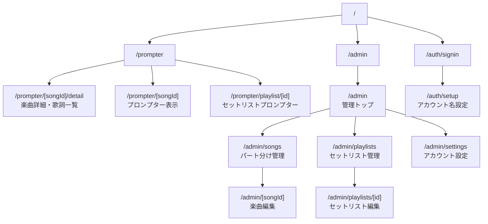
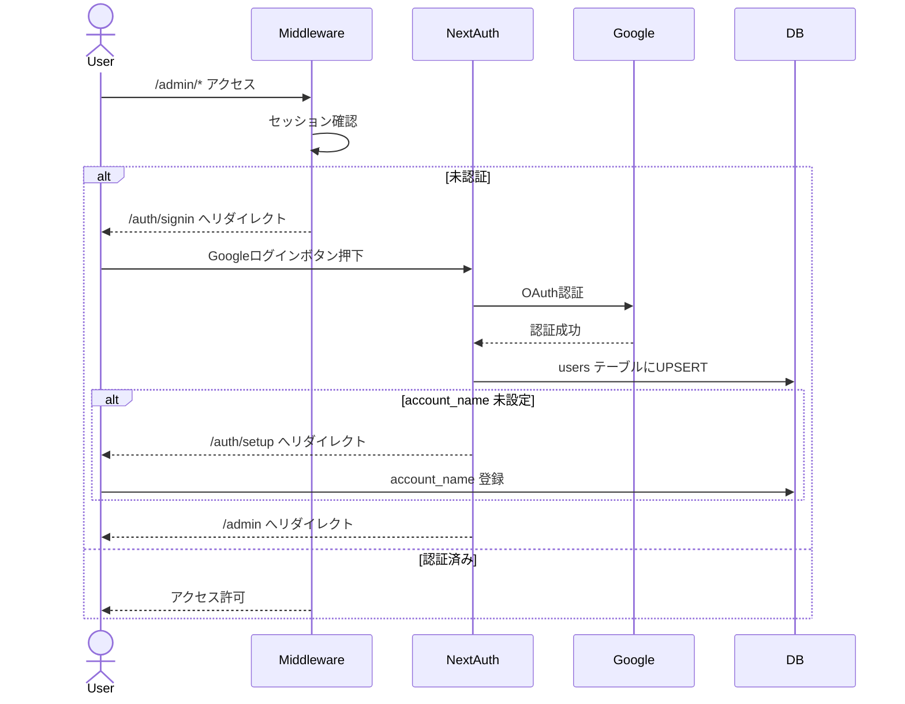
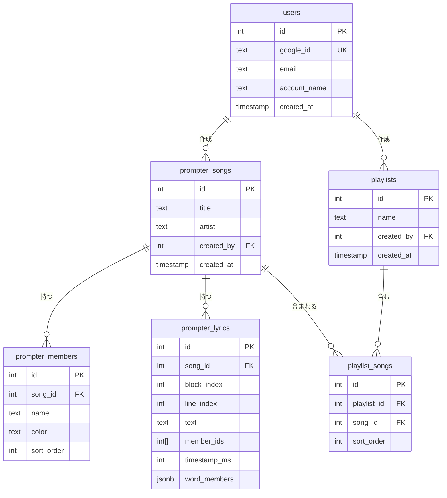
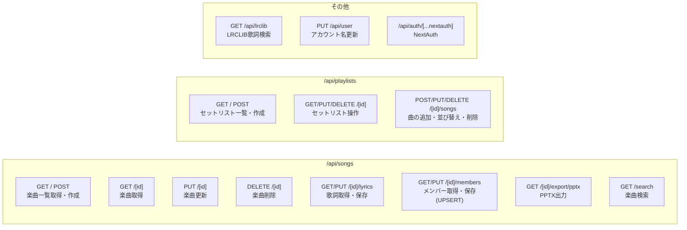
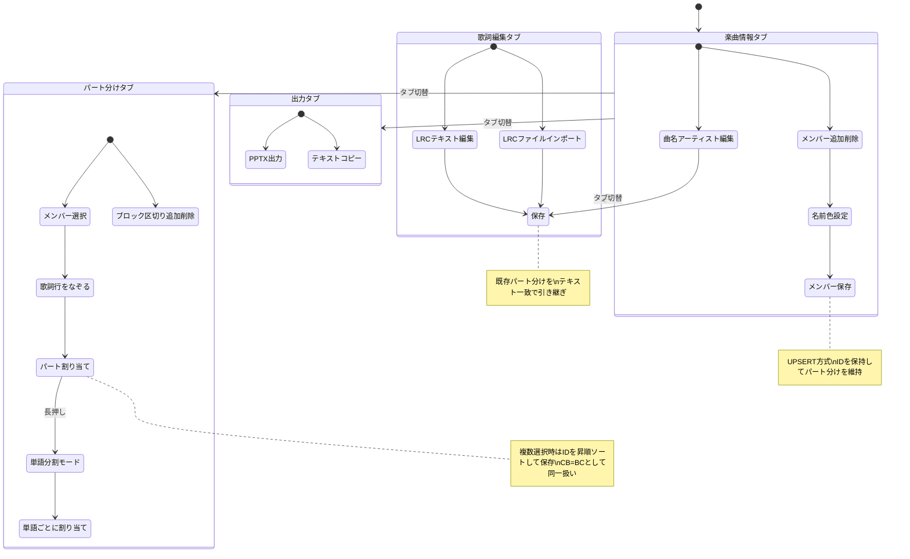
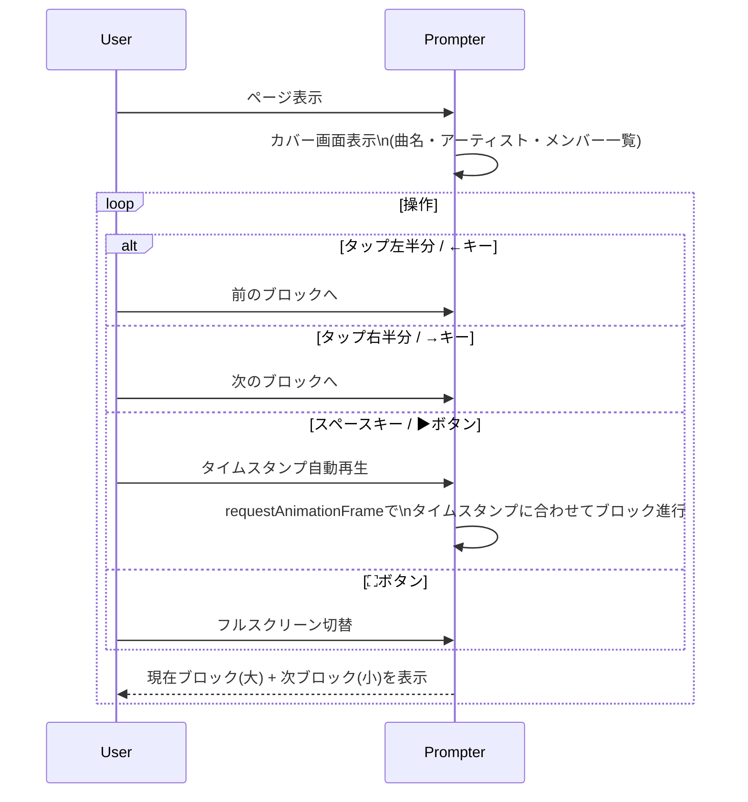
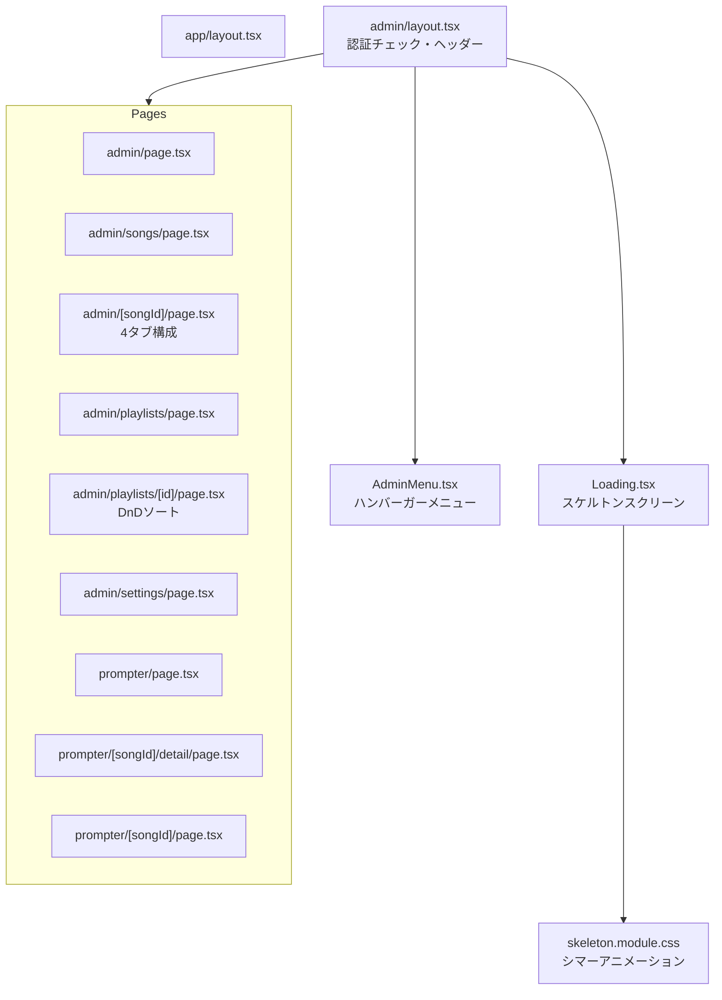

# Part Prompter 仕様書

## システム概要

歌詞プロンプター＆パート分けアプリ。楽曲の歌詞をメンバーごとに色分けし、プロンプター表示・PPTX出力ができる。

---

## URL構成

---

## 認証フロー

---

## データモデル

---

## API一覧

---

## 楽曲編集フロー（/admin/[songId]）

---

## プロンプター表示フロー（/prompter/[songId]）

---

## コンポーネント構成

