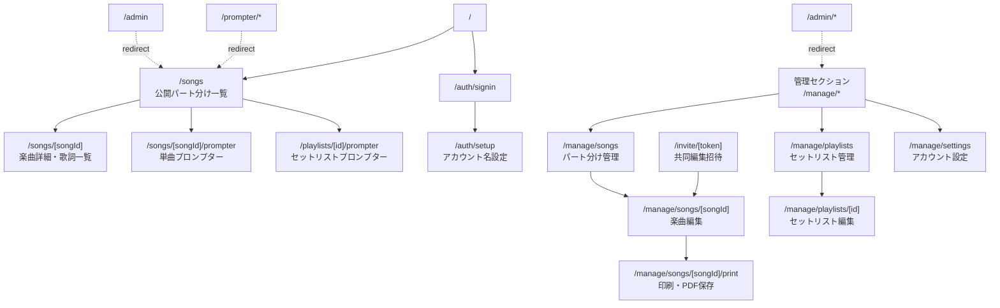
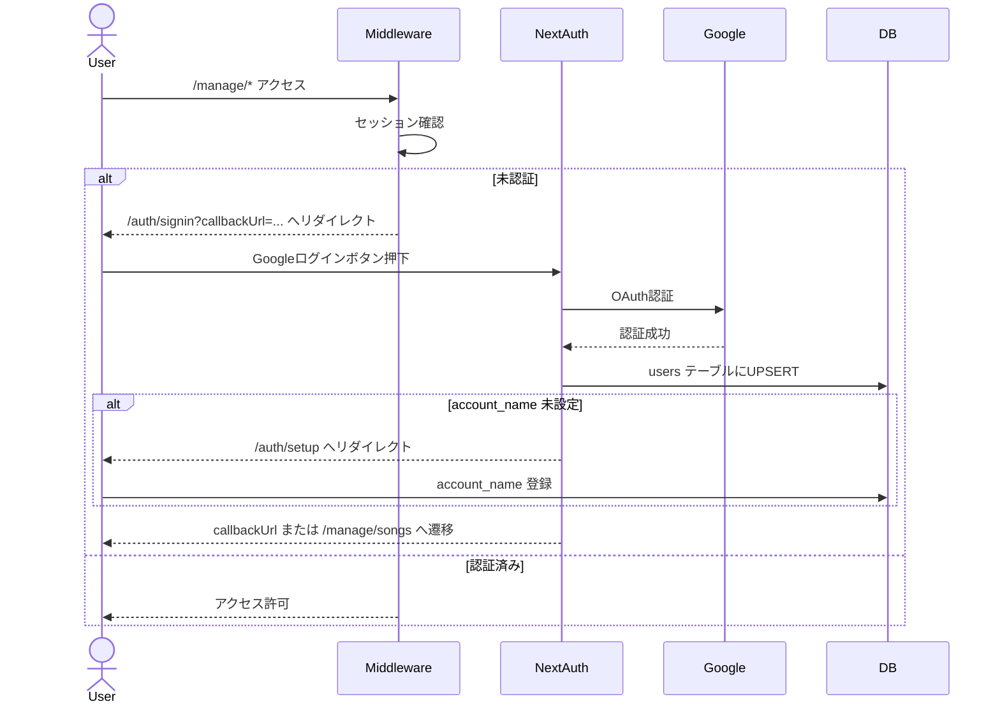
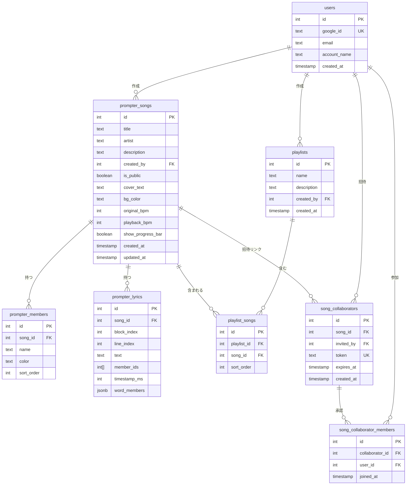
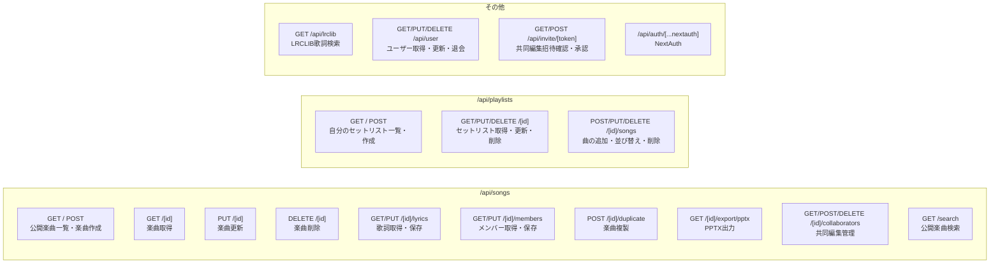
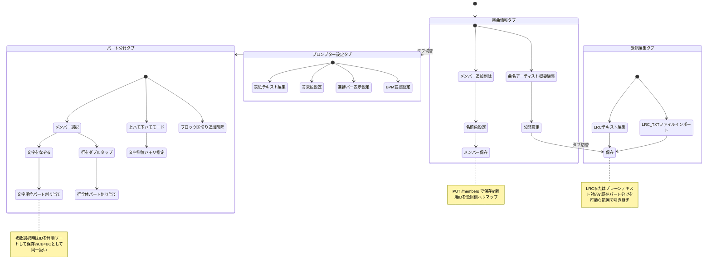
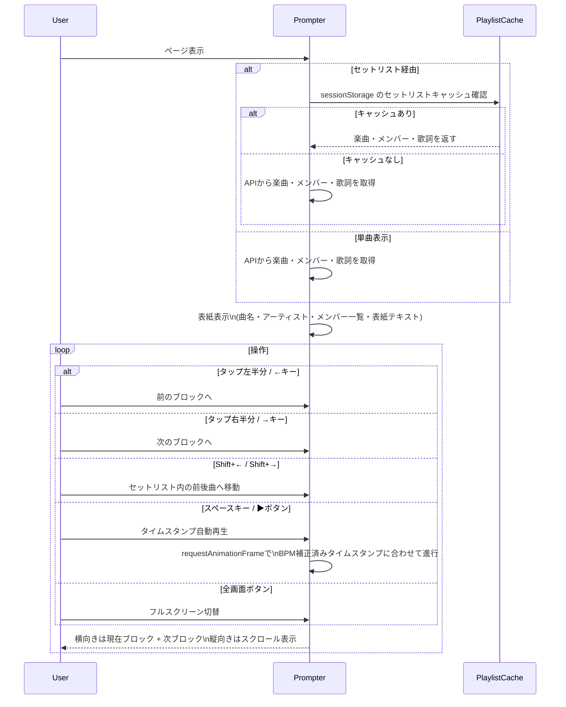
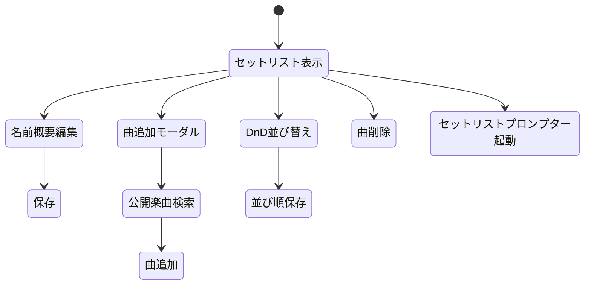
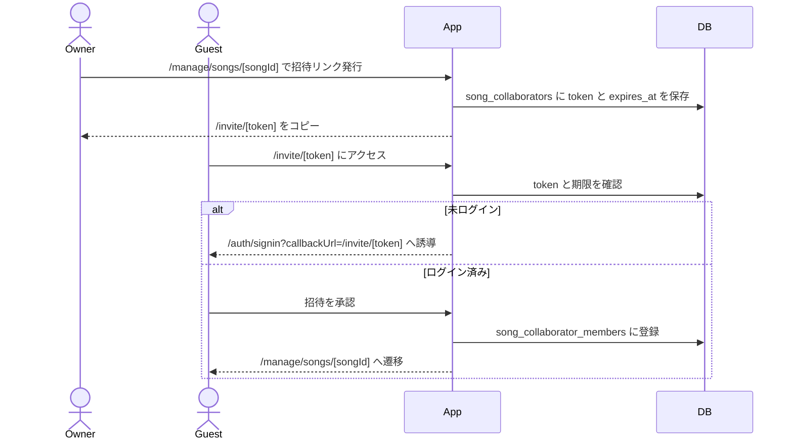
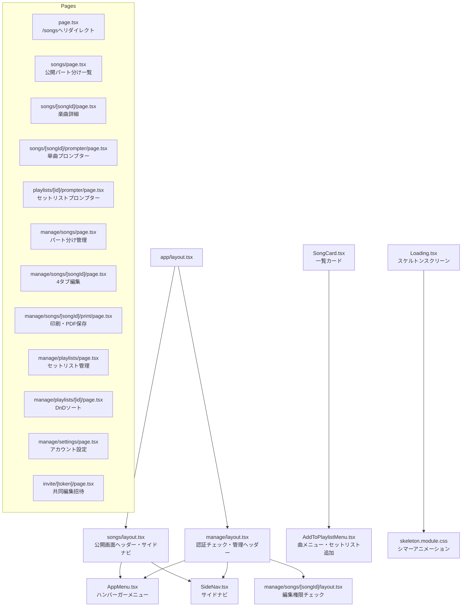

# Part Prompter 仕様書

## システム概要

歌詞プロンプター＆パート分けアプリ。楽曲の歌詞をメンバーごとに色分けし、詳細閲覧、プロンプター表示、セットリスト再生、PPTX出力、印刷/PDF保存、共同編集ができる。

---

## URL構成

---

## 認証フロー

---

## データモデル

---

## API一覧

---

## 楽曲編集フロー（/manage/songs/[songId]）

---

## プロンプター表示フロー（/songs/[songId]/prompter）

---

## セットリスト編集フロー（/manage/playlists/[id]）

---

## 共同編集フロー

---

## コンポーネント構成

