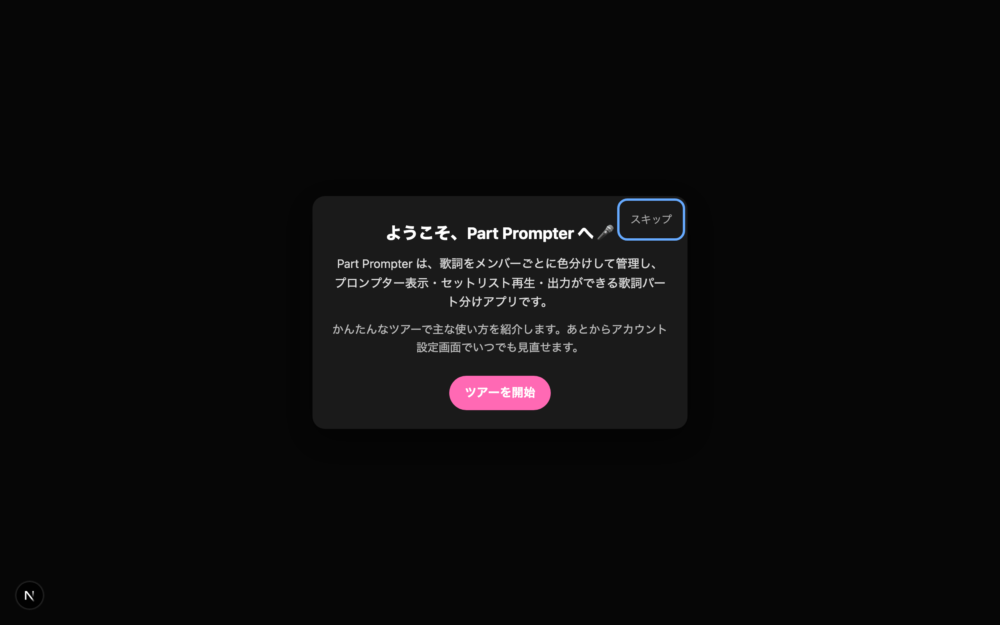
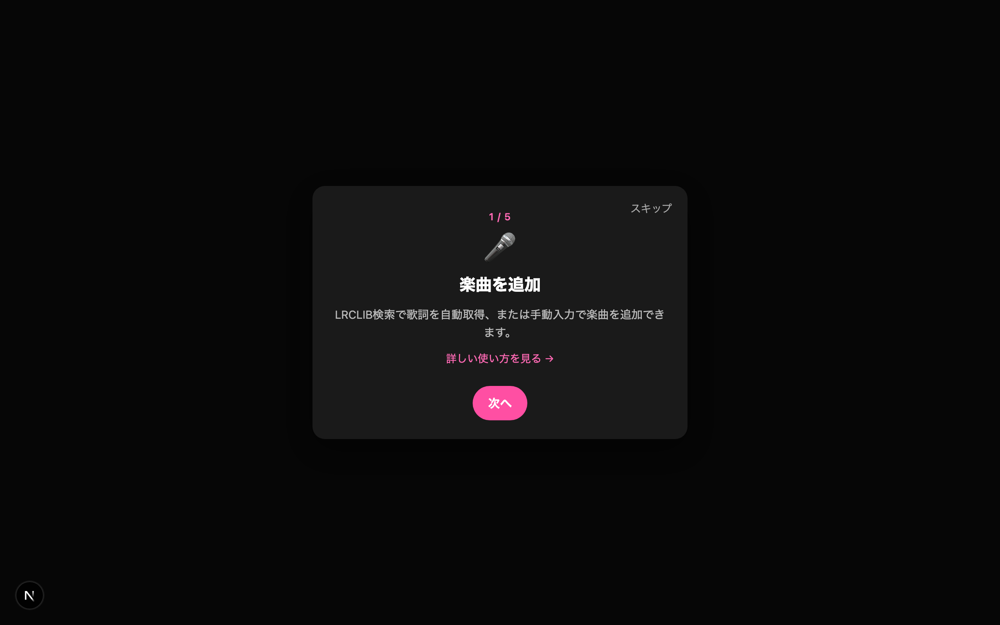
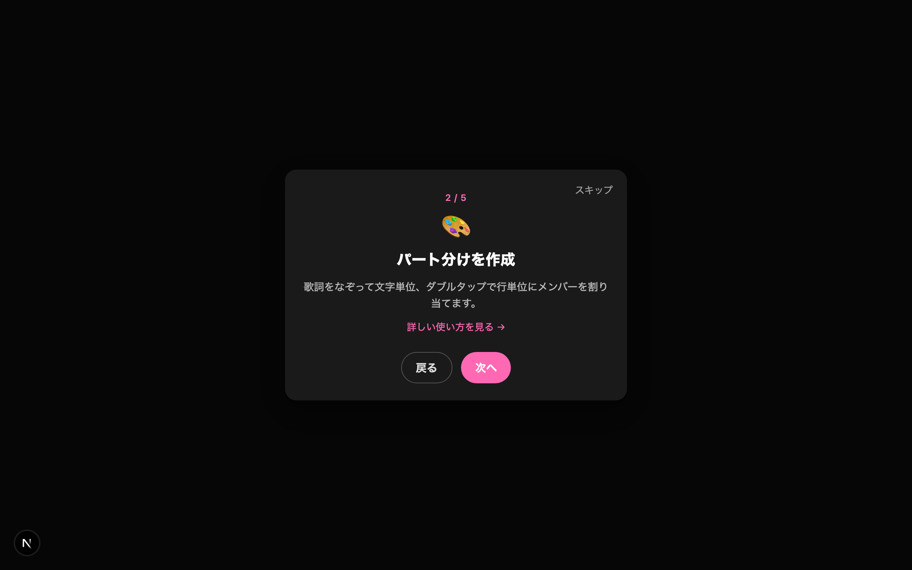
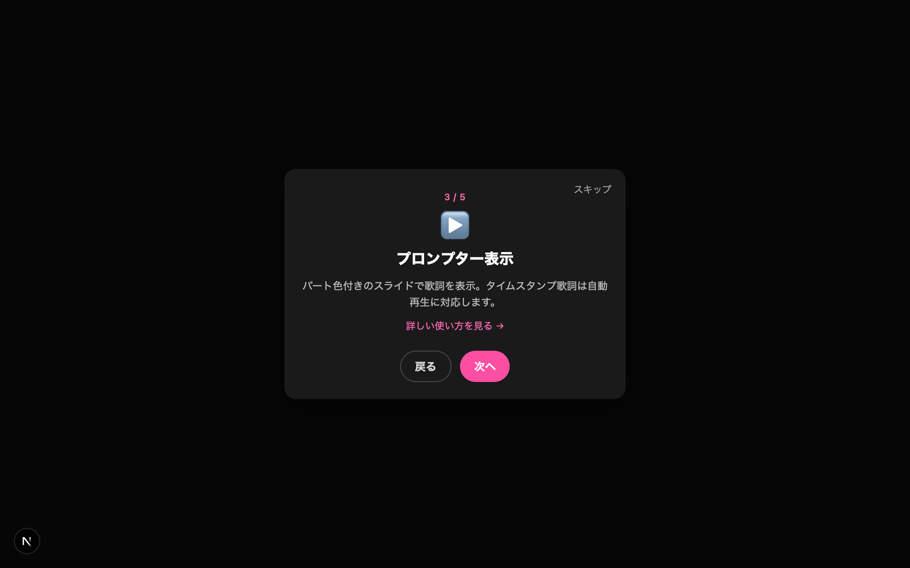
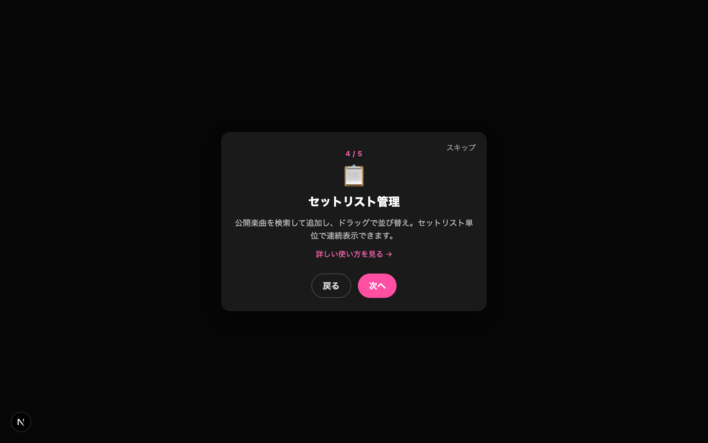
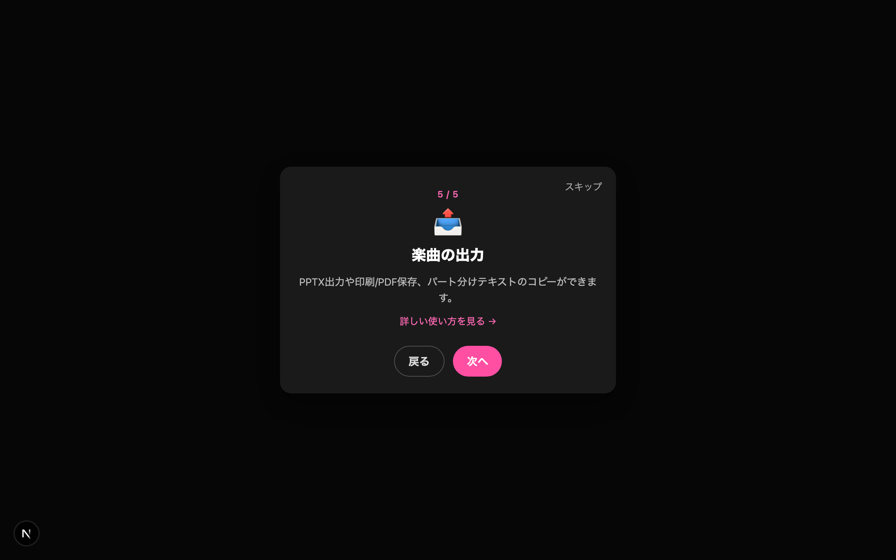
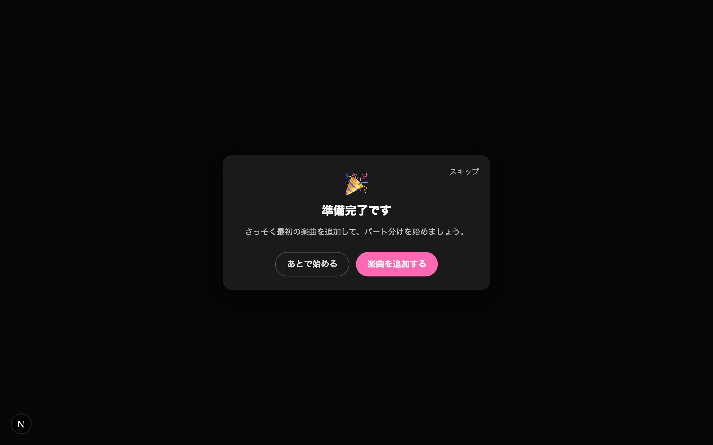
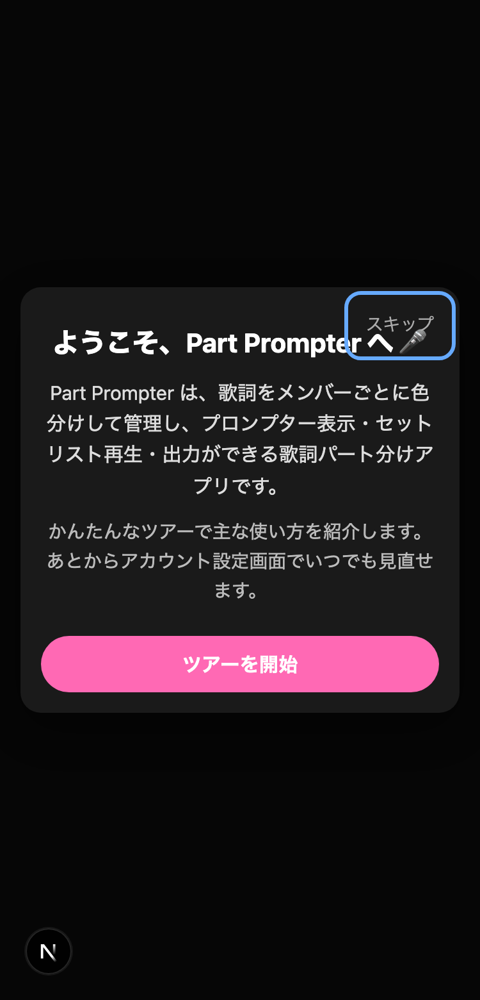
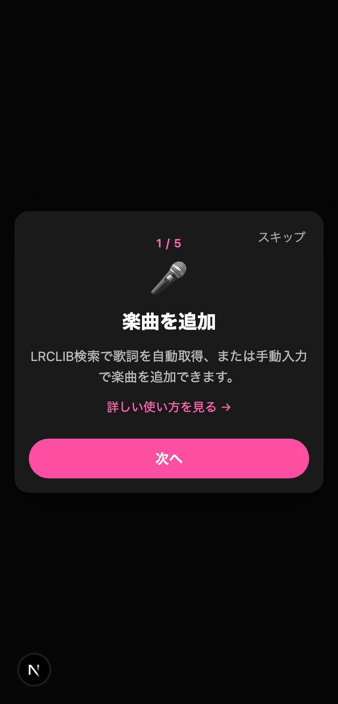

# オンボーディング機能ガイド

Part Prompter には、初めてログインしたユーザー向けのオンボーディング（使い方案内）があります。アカウント名設定を終えて管理画面に入ると自動的に表示され、アプリの主な機能をステップで紹介します。

> 掲載画像は説明用に撮影したものです。文言・デザインは変更される場合があります。

## 表示されるタイミング

- Google アカウントでログインし、アカウント名を設定（`/auth/setup`）した直後、`/manage/songs` に到達したとき自動表示されます。
- 一度「完了」または「スキップ」すると、以降は自動表示されません（複数端末でも同様）。
- 機能リリース前から利用していた既存ユーザーには表示されません。
- あとから見直したいときは、アカウント設定画面（`/manage/settings`）の「🎤 オンボーディングをもう一度見る」から再表示できます。

## 1. ウェルカム画面

最初にアプリの概要を案内します。「ツアーを開始」で機能紹介に進みます。右上の「スキップ」はどの画面からでも押せます。

## 2. 機能紹介ツアー（全5ステップ）

主要機能を順番に紹介します。画面上部に「現在 / 総数」の進捗が表示され、「次へ」「戻る」で移動できます。各ステップには詳しい使い方ページ（`/how-to-use`）への導線があります。

### ステップ 1: 楽曲を追加
LRCLIB検索で歌詞を自動取得、または手動入力で楽曲を追加できます。

### ステップ 2: パート分けを作成
歌詞をなぞって文字単位、ダブルタップで行単位にメンバーを割り当てます。

### ステップ 3: プロンプター表示
パート色付きのスライドで歌詞を表示。タイムスタンプ歌詞は自動再生に対応します。

### ステップ 4: セットリスト管理
公開楽曲を検索して追加し、ドラッグで並び替え。セットリスト単位で連続表示できます。

### ステップ 5: 楽曲の出力
PPTX出力や印刷/PDF保存、パート分けテキストのコピーができます。

## 3. 完了画面

最後に最初のアクションへ誘導します。「楽曲を追加する」または「あとで始める」を押すと案内を終了し、パート分け管理画面（`/manage/songs`）へ移動します。

## スマートフォン表示

レイアウトはスマートフォン幅にも対応しています。ボタンは縦並びになり、タッチしやすいサイズで表示されます。

| ウェルカム | ツアー |
|---|---|
|  |  |

## 操作方法（キーボード）

- **Tab / Shift+Tab**: 画面内のボタンを移動（オーバーレイ内でフォーカスが循環します）
- **Enter / Space**: フォーカス中のボタンを実行
- **Esc**: 案内を閉じる（スキップと同等。閉じると元の位置にフォーカスが戻ります）

## 補足

- 案内の表示状態は `users.onboarding_completed_at`（NULL=未完了 / 日時=完了済み）で管理しています。
- 動作確認で再表示したい場合は、対象ユーザーの当該カラムを `NULL` に戻してください。
